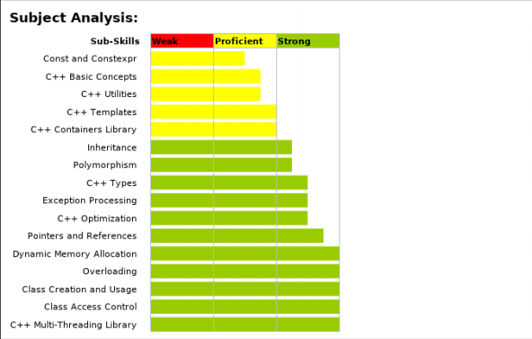

IKM

# 网上的

https://www.51wendang.com/doc/5500ace510021256958842e1

 IKM测试攻略_Test(71题)

经过了2个多小时的鏖战，总算是完成了传说中的IKM C++ Programming test, 中介的信上说要在 3rd Oct 3:00AM 前完成它，于是我花了两天半时间把所有可以看得，能够成为知识点的都看了个遍（后来发现我真是很傻很天真，这份考卷的难度远远大于我的预计），好在中介信上有说明如果INTENET断线了该怎么处理，这个给我后面的投机取巧埋下了伏笔。不过这个已经是我这辈子做过的最难的C++ test 了，上个学期的C++ 课的卷子老师已经出的很难了，但是和这个相比，哎，差距太大了。完成考试后，成绩马上递到我邮箱，不是很理想啦，分数是还好，但是在所有参与者里面的排名是很低的。55555下面开始总结经验吧。

先说说看这个考试吧，要求很多，一个很不好应付的考试。

1，每一题有5个选项，但是最多只能选3个答案，多选哦

2，每一题最多只能选3个答案。（和第一条是一样的哦，翻译过来就是这样的啦.........）

3，如果某一题实在不会，建议跳过。（对于每一题里面的每一个选项，如果选择错误的选项，扣分，选择正确的选项，得分，对于每一题，回答的完全正确，得分，回答不完全正确，扣分，如果跳过题目，扣分。额，把答题者往死里整就是了........）

4，如果可以将正确答案的范围缩小到两个答案，并且你选择这两个是可以保证一个是正确的情况下，建议你选择这两个，因为这样可以拿分。

5，如果一题已经被答过了或者被跳过了，是不能回去重新答题的。

6，答题的准确性比答的快更重要。

7，对每一个问题，当问题全部显示在浏览器上时，才开始计算时间。

8，一旦测试开始，必须一直接续直到测试结束。(其实是可以断线的啦..............)

测试结果

最后成绩不好呢，归根结底还是自己的实力的问题，在很多题上时间花的太多了，时间花的很多也直接导致了我最后排名的不高。如果很精通程序很精通概念了，那么应该是可以很快做完的。最最后上图吧：

测试经验

第一，开着google，开着金山词霸（虽然没有怎么用到），开着MSDN（有几次救险），开着截图工具的方法是对的，是有效可行的。

先说google和MSDN，因为IKM测试里面的问题有一些问的很巧妙，而且选项有多，特别是关于概念性的问题比较多，考的知识点很细很散，遇到很概念的问题（还不少），因为平时基本不会接触到，比如异常处理的时候，抛出什么句柄之类的，是否回收资源之类的，STL的container adapter之类的（这个就是当场查出来的，我根本不会），MSDN可以帮上很大的忙。但是如果遇到一些不是很概念的问题，比如，关于友元类和几个类继承关系在一起的时候，我当时就直接晕了, 就可以找google。

总结：纯概念性的问题，还是要看MSDN，因为MSDN 最全面，但是有的时候google可以搜到IBM的帮助文件，也很有帮助，其他概念性有模糊的地方，需要google.

第二， 金山词霸有一定的帮助，做题的时候遇上有一些词真的不知道什么意思，查！所以先把它开着。

第三， 截图工具，每一道题一出来，第一件事就是点快捷键截图，这里的题目每一题都不是那么简单，收集起来有时间慢慢想。

还有一个很大的教训，在IKM test 里面有为数众多的程序题（有差不多40%--50%），一开始我一直以为这样一个经典的考试是有防拷贝机制的，我们的复制粘贴应该是无效的，前面n个题目我都是自己脑子想的，所以估计就死在这上面了，作了差不多20多题了以后，发现越来越多的程序题，而且居然还可以复制.......然后就开始后悔，感叹，叹生不逢时，上次我明明看到哪个阿渣说试题是不可以复制的，昨天我就在犹豫要不要安装编译器，如果我昨天装了http://www.51wendang.com多好了，我可以直接复制，运行，看答案了.......痛定思痛，干脆一不做二不休，月黑风高杀人夜，日照香炉生紫烟，直接禁止无线网络连接，先断网，然后开始安装http://www.51wendang.com，中间的半个小时真的很漫长，新浪开了又关关了又开，什么玻利维亚国脚集体退出国家队，TM他们怎么还不去死。安装完毕，测试确实可以运行了以后，打开网页，重新登入，接着上次的题目继续做，这下就好多了，期间有差不多5题是程序题，每题的答题时间不到30秒。但是前面答过的题估计就没戏了。

网申结束后2天收到邮件，通知进行IKM online

test，有C++, C#, Java可供选择，选择其一即可。收到邮件后，开始在网上收IKM的相关资料，但很遗憾，没有找到原题。从查到的信息来看，大概是说这个测试很难，题目是adaptive的。另外可以找到考试的说明，大概来说，题目都是选择题，答题的正确率比速度更重要等等。

也不知道怎么准备。。于是开着google，旁边放本C++ premier就开始做题。选的是C#的题目，一共35分钟。题目范围很广，涉及到多线程（lock等知识点）、内存管理、调试、界面类（与C#对应）、多态继承以及一些设计模式的问题。另外，还有给个程序，让你指出哪里有错误的题目。题目确实很难，而且大部分题一时半会是查不到。我做题速度很慢，一共只做了20多道题，估计要挂。 另外，之前在网上查到一篇博客说，考试的时候可以复制题目，**我试着复制了一下，立刻弹出一个警告，说考试题目不允许复制，要是再复制的话，考试将自动终止。所以，题目是不能直接复制的**。

题目太难，好多都是我不熟悉的，所以也没记住太多信息。Anyway，希望对大家有帮助！

发表于 2012-3-21 16:26:12

“楼上很厉害啊，我考的JAVA，做了大概20道的样子，坑爹的5选项不定选择，全是考什么异常静态类之类的东西，还有大量的uml题，能把英文看懂就不错了，算了反正没啥希望了，还是等好好复习下再继续参加其他的笔试

发表于

2012-3-22 17:44:06

刚做完了，只做了17道。貌似题目都是看上去不难（我的意思是以概念题为主，看来我悲剧了，做的太差，系统默认给我越来越简单了），当然我还是不会做就是了。悲剧啊。。

选的C++，貌似主要考C++、面向对象和unix线程的一些概念。

发表于

# 我做的

