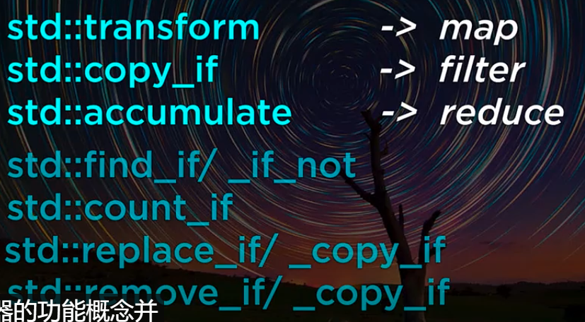
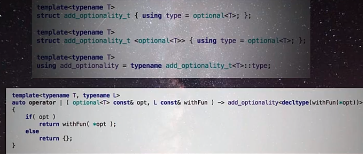
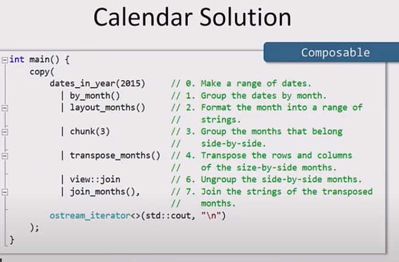

学到的几个技巧

| 传统写法                                                     | 函数式写法                                                   |
| ------------------------------------------------------------ | ------------------------------------------------------------ |
|  |  |
|                                                              |  |
|                                                              |  |
|                                                              |  这个rust早就有了 |
|                                                              |  |
|                                                              |  这个rust做得更好，它的option本身就可以转为iterator，所以自然有所有的相关功能 |
|                                                              |  |
|                                                              |  |
|                                                              |  |
|                                                              |  |
|                                                              |                                                              |
|                                                              |                                                              |
|                                                              |                                                              |