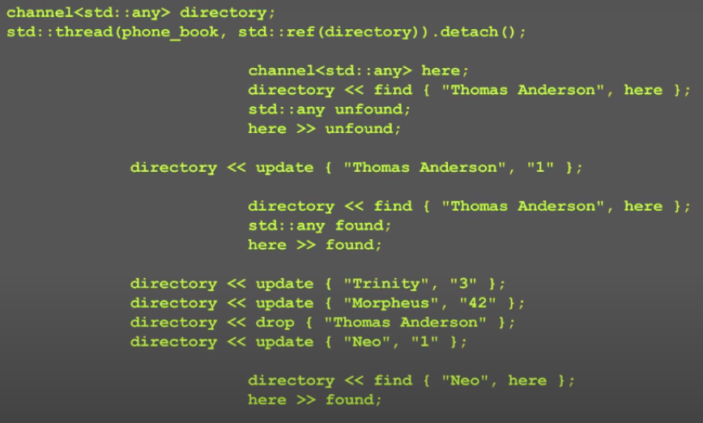

Kevlin Henney - Functional C++观后感

https://www.youtube.com/watch?v=CIg6eyJv4dk

# 觉得不错的地方

## date的设计

下面这个date不好，因为有set导致class内部有状态。他用第二种方法把class改成没有任何mutable的函数，这样就不会存在mutable的问题了

# 有几个问题

Q: 他设计的这个functional的vector，其实本质上不是一般意义上的vector了

- pop是创建一个view

- push是创建一个链表

- 他说用fill_n往list里放很多数据会搞坏stack，但我看代码没有这个问题，因为数据其实是在heap上的，问题是在heap上有很多的shared_ptr导致性能差
- 他用sharedptr保存数据，他自己也说性能不好。但他给不出解决方案

Q1: 这段代码是个死循环，如何退出循环？

Q2：他讲了phonebook的两个实现，一个是基于lock的来实现线程安全性，一个是用channel，相当于把对phonebook的操作放在一个单独的线程里从而实现不需要考虑线程安全性。

我承认第二种实现看起来漂亮很多，代码好维护，但是

我的问题是，第二种实现会不会效率不如第一种快，因为每次操作都要跨线程？

Q3：channel需要发送和接受顺序对应好，如果搞错了那不就惨了。比如上面的图，find之后需要接收一个结果，而update之后不需要。这个只能从代码或者文档中看到，从函数签名看不到。这意味着一种危险，也就是无法通过编译器检查到问题。而用mutex的没有这个问题。

从这个角度，如果要提供一个安全的用法，应该在channel上面提供一个更安全的抽象

# 其他

关于我的问题，在网上也有人表了类似的困惑

https://news.ycombinator.com/item?id=9808232