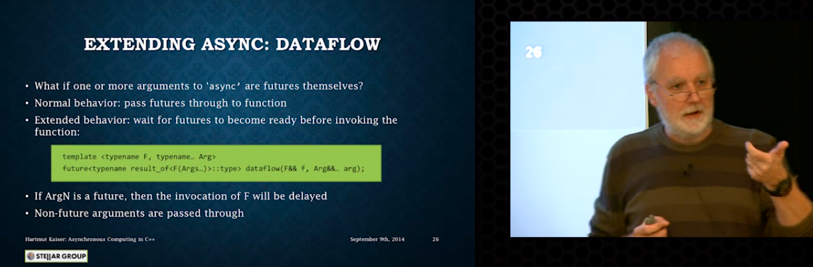
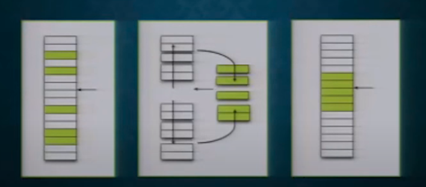
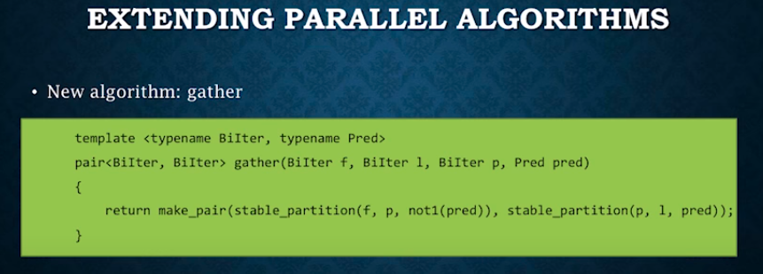
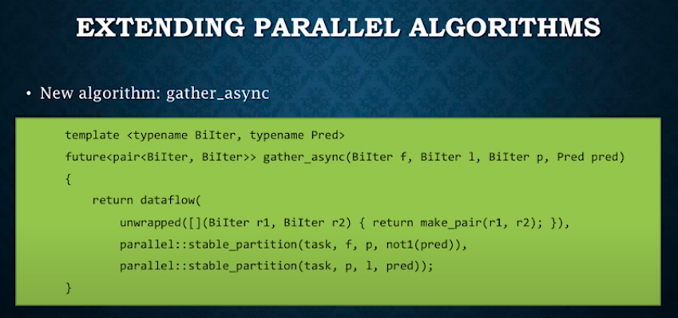
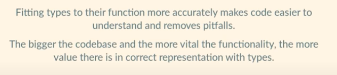
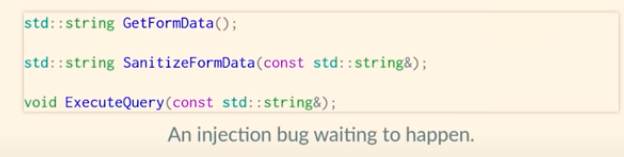
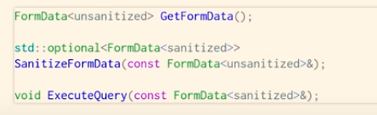
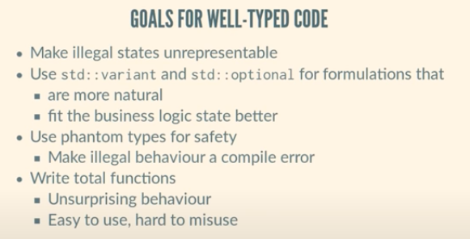

# CppCon 2014: Hartmut Kaiser "Asynchronous Computation in C++"

https://www.youtube.com/watch?v=5xyztU__yys&t=82s

基於HPX環境

重用c++已有功能，比如 `future<T>`

不可能每個task都需要用一個kernel thread實現

爲什麽thread慢

OpenMP的limitaiton

講了標準庫future，以及std::async()，packed_task<T>, promise<T> (話説我覺得標準庫搞得好難理解)

Extend future<T>，允許sequential composition (ie then)，parallel_composition (ie when_all)

Parallel algorithms (usage look like STL)

HPX 代碼： https://github.com/STEllAR-GROUP/hpx

他們的組織： https://en.wikipedia.org/wiki/HPX， https://stellar-group.org/

thread overhead比較：比tbb還好

hpx所有的東西都是serializable的，比如可以把一個function發送到別的機器？

一個關鍵的extending：實現一個dataflow函數，該函數等待參數future ready才執行函數



擧了個例子，

## 例子1：gather



用傳統方法實現



用hpx實現



以上的本質是建立了一個data flow graph

Q: rust的par_iter是否也是同樣原理？ 如何比較兩者的優劣

Q：opencv的t-graph libraries感覺也類似。如何比較兩者的優劣

opencv的那個后面還有編譯器優化

Q：他那個future的具體實現裏面是否包含同步原語，比如event之類？


感受：

編程這門手藝，做的好，看起來真漂亮

這居然是一個美國高校搞出來的，中國有多少高校，公司能做出同等質量的產品？

## 例子2：heat

openmp的一個問題是并行化之後會有一個join，這個join會用很多時間

# CppCon 2014: Pablo Halpern "Decomposing a Problem for Parallel Execution"

https://www.youtube.com/watch?v=Ej97699t-G0

# CppCon 2014：Mark Maimone“火星上的C ++：将C ++集成到火星漫游者飞行软件中”

https://www.youtube.com/watch?v=3SdSKZFoUa8&t=42s

# CppCon 2016: Marshall Clow “STL Algorithms - why you should use them, and how to write your own"

https://www.youtube.com/watch?v=h4Jl1fk3MkQ&t=22s

這個演講比較簡單，隨便看看就行

# CppCon 2016: Greg Law “GDB - A Lot More Than You Knew"

https://www.youtube.com/watch?v=-n9Fkq1e6sg

講的是gdb的技巧

gcc -g t.c

gdb a.out

start

next

list

call fn


### tui


tui enable, or ctrl+X,then ctrl+A

Ctrl+L, repaint

## python

xxx

end to exit python

## shell to exe system command, eg

shell ls

## reverse debugging

turn on core dump

```sh
ulimit -c unlimited
```

gdb -c core_file_name


bt	backtrace

利用record功能

# CppCon 2016: Ben Deane “Using Types Effectively"

https://www.youtube.com/watch?v=ojZbFIQSdl8

講的是合理利用好類型

設計的類型要和功能盡可能的貼近



比如，如下不好




如下好





Q: phantom type

Q: partial functions vs total functions

https://dzone.com/articles/total-and-partial-functions-in-fp