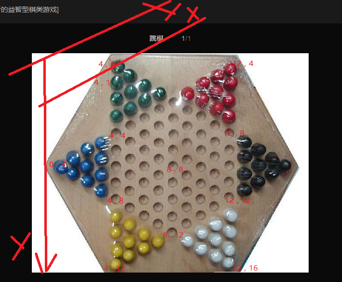
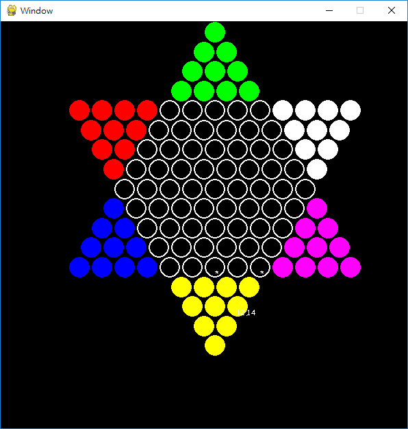

软件设计

游戏库选择：pygame

棋子坐标系设计：定义每一个棋子的坐标



棋子坐标系到图像坐标系的转换函数 get_coord

棋子初始位置 init_pos_to_group

显示棋子

棋子状态图：用一个17x17的矩阵表示，元素值

- 无效位置 -2
- 有效，但没棋子 -1
- 有效，有棋子，0-5，值表示棋子的group id


代碼

```python
# 

import pygame
import math
import numpy as np

pygame.init()

GAME_FONT = pygame.font.SysFont('Comic Sans MS', 11)
radius = 15
pitch = radius*2.2
window_size = (int(pitch*18),int(pitch*18))
window = pygame.display.set_mode(window_size)
pygame.display.set_caption("Window")

black = (0,0,0)
red = (255,0,0)
green = (0,255,0)
blue = (0,0,255)
white = (255,255,255)
colors = [red,green,blue,white, (255, 255, 0), (255, 0, 255)]

ELEM_INVALID = -2
ELEM_VALID_IDLE = -1
ELEM_VALID_GROUP_0 = 0


def groupid_to_color_width(g):
    if g==ELEM_INVALID:
        return None, 0

    if g==ELEM_VALID_IDLE:
        return white, 2

    if g>=0:
        return colors[g], 0
    
    assert False

# ...

def get_init_matrix():
    M = np.ones((17,17), dtype=np.int8)*ELEM_INVALID

    M[4:5, 0] = 0
    M[4:6, 1] = 0
    M[4:7, 2] = 0
    M[4:8, 3] = 0

    M[0:4, 4] = 1
    M[1:4, 5] = 1
    M[2:4, 6] = 1
    M[3:4, 7] = 1

    M[9:13, 4] = 2
    M[10:13, 5] = 2
    M[11:13, 6] = 2
    M[12:13, 7] = 2

    M[4:5, 9] = 3
    M[4:6, 10] = 3
    M[4:7, 11] = 3
    M[4:8, 12] = 3

    M[13:14, 9] = 4
    M[13:15, 10] = 4
    M[13:16, 11] = 4
    M[13:17, 12] = 4

    M[9:13, 13] = 5
    M[10:13, 14] = 5
    M[11:13, 15] = 5
    M[12:13, 16] = 5

    M[4:9, 4] = ELEM_VALID_IDLE
    M[4:10, 5] = ELEM_VALID_IDLE
    M[4:11, 6] = ELEM_VALID_IDLE
    M[4:12, 7] = ELEM_VALID_IDLE
    M[4:13, 8] = ELEM_VALID_IDLE
    
    M[5:13, 9] = ELEM_VALID_IDLE
    M[6:13, 10] = ELEM_VALID_IDLE
    M[7:13, 11] = ELEM_VALID_IDLE
    M[8:13, 12] = ELEM_VALID_IDLE

    return M

def get_pix_coord(x,y):
    xx = (10*0.5+x-y*0.5+0.5)*pitch
    yy = (y*math.sqrt(3)/2+0.5)*pitch
    return xx,yy

def draw_text(screen, Text, PixPos, Color):
    textsurface = GAME_FONT.render(Text, False, Color)
    screen.blit(textsurface,PixPos)

def dist(p1, p2):
    dx = p1[0]-p2[0]
    dy = p1[1]-p2[1]
    return math.sqrt(dx*dx + dy*dy)

def test_dis():
    p04= get_pix_coord(0,4)
    p14= get_pix_coord(1,4)
    p15= get_pix_coord(1,5)
    d1 = dist(p04, p14)
    d2 = dist(p15, p14)
    print(d1)
    print(d2)

test_dis()

def point_in_circle(pt, center, radius):
    x_in_range = pt[0] >= center[0] - radius and pt[0] <= center[0] + radius
    y_in_range = pt[1] >= center[1] - radius and pt[1] <= center[1] + radius
    return x_in_range and y_in_range

possible_offsets=[
    [-1, -1],
    [-1, 0],
    #[-1, 1],
    [0, 1],
    [1, 1],
    [1, 0],
    #[1, -1],
    [0, -1],
]

def is_valid_pos(M, idx_pos):
    x = idx_pos[0]
    y = idx_pos[1]
    return x>=0 and x<M.shape[1] and y>=0 and y<M.shape[0]

def get_possible_jump_next_idx_pos(M, current_idx_pos, next_poss):
    x = current_idx_pos[0]
    y = current_idx_pos[1]

    next_temps = []
    for offset in possible_offsets:
        next_x = x + offset[0]
        next_y = y + offset[1]
        next_x2 = x + offset[0]*2
        next_y2 = y + offset[1]*2
        next = (next_x2, next_y2)
        if is_valid_pos(M, (next_x, next_y)) and M[next_y][next_x]>=0 \
            and is_valid_pos(M, (next_x2, next_y2)) and M[next_y2][next_x2]==ELEM_VALID_IDLE \
            and not next in next_poss:
            next_temps.append(next)

    ret = next_poss + next_temps
    for next in next_temps:
        ret = ret + get_possible_jump_next_idx_pos(M, next, ret)
    return ret

def get_possible_next_idx_pos(M, current_idx_pos):
    x = current_idx_pos[0]
    y = current_idx_pos[1]

    if M[y][x]<0: return []
    
    next_poss = []
    # the function is not complete!
    for offset in possible_offsets:
        next_x = x + offset[0]
        next_y = y + offset[1]
        if is_valid_pos(M, (next_x, next_y)) and M[next_y][next_x]==ELEM_VALID_IDLE:
            next_poss.append((next_x, next_y))

    next_poss2 = get_possible_jump_next_idx_pos(M, current_idx_pos, [])
    
    return next_poss + next_poss2

def get_idx_pos_from_mous_pix_pos(M, mouse_pix_pos):
    (h,w) =M.shape
    for y in range(h):
        for x in range(w):
            xx, yy = get_pix_coord(x,y)
            if point_in_circle(mouse_pix_pos, (xx,yy), radius):
                return (x,y)
    return None

def draw_all(window, M):
    (h,w) =M.shape
    for y in range(h):
        for x in range(w):
            g = M[y][x]
            color, width = groupid_to_color_width(g)
            if color is not None:
                xx, yy = get_pix_coord(x,y)
                pygame.draw.circle(window,color,(xx,yy), radius, width)
                #draw_text(window, "%d,%d"%(x,y), (xx,yy), white)

def draw_curr_and_possible_nexts(window, M, idx_pos):
    if idx_pos is not None:
        (x,y) = idx_pos
        xx, yy = get_pix_coord(x,y)
        draw_text(window, "%d,%d"%(x,y), (xx,yy), white)

        next_poss = get_possible_next_idx_pos(M, (x,y))
        for next_pos in next_poss:
            xx2, yy2 = get_pix_coord(next_pos[0], next_pos[1])
            draw_text(window, "*", (xx2, yy2), white)

def move_obj(M, mouse_idx_pos, mouse_next_idx_pos):
    (x,y) = mouse_idx_pos
    (x2,y2) = mouse_next_idx_pos
    M[y2][x2] = M[y][x]
    M[y][x] = ELEM_VALID_IDLE

gameLoop = True
#mouse_pix_pos = None
mouse_idx_pos = None
#next_mouse_pos = None
#next_mouse_poss_poss = []
possible_next_idx_poss = []

LEFT = 1
RIGHT = 3

M = get_init_matrix()

FirstTime = True

while gameLoop:
    with_event = False
    for event in pygame.event.get():
        if (event.type==pygame.QUIT):
            gameLoop = False
        elif (event.type==pygame.MOUSEBUTTONDOWN):
            with_event = True
            if event.button == LEFT:
                mouse_pix_pos = list(pygame.mouse.get_pos())
                mouse_idx_pos = get_idx_pos_from_mous_pix_pos(M, mouse_pix_pos)
                possible_next_idx_poss = get_possible_next_idx_pos(M, mouse_idx_pos)
            elif event.button == RIGHT:
                mouse_pix_pos = list(pygame.mouse.get_pos())
                mouse_next_idx_pos = get_idx_pos_from_mous_pix_pos(M, mouse_pix_pos)
                if mouse_next_idx_pos in possible_next_idx_poss:
                    print('OK')
                    move_obj(M, mouse_idx_pos, mouse_next_idx_pos)
                    mouse_idx_pos = None
                    possible_next_idx_poss = []

    if with_event or FirstTime:           
        window.fill(black)
        draw_all(window, M)
        draw_curr_and_possible_nexts(window, M, mouse_idx_pos)
        pygame.display.flip()

        FirstTime = False

pygame.quit()


```


Features

- [x] 顯示跳棋
- [x] 左鍵點擊一個跳棋，顯示可能的下一個位置
- [x] 右鍵點擊可能的位置，移動跳棋
- [ ] AI機器人





