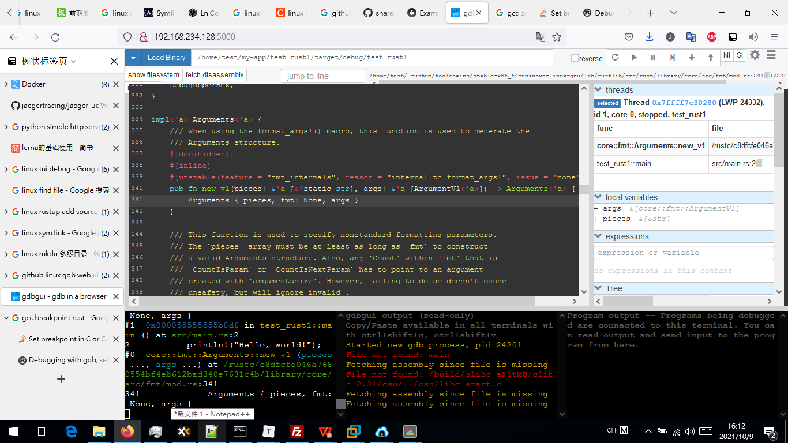

```bash
# setup rust codes
mkdir -p /rustc/c8dfcfe046a7680554bf4eb612bad840e7631c4b 

ln -s /home/test/.rustup/toolchains/stable-x86_64-unknown-linux-gnu/lib/rustlib/src/rust/library /rustc/c8dfcfe046a7680554bf4eb612bad840e7631c4b/library 

# install 
# https:#www.gdbgui.com/gettingstarted/

python3 -m pip install --user pipx
python3 -m userpath append ~/.local/bin
Restart/re-source your console to make sure the userpath is up to date.
pipx install gdbgui

# start debug
gdbgui --host "0.0.0.0"

#access http:#192.168.234.128:5000/
#input link /home/test/my-app/test_rust1/target/debug/test_rust1
#click refresh button to load start the program, debugger will stop at main
# set breakpoint
b main.rs:1
b main.rs:2
#click "run"
```


