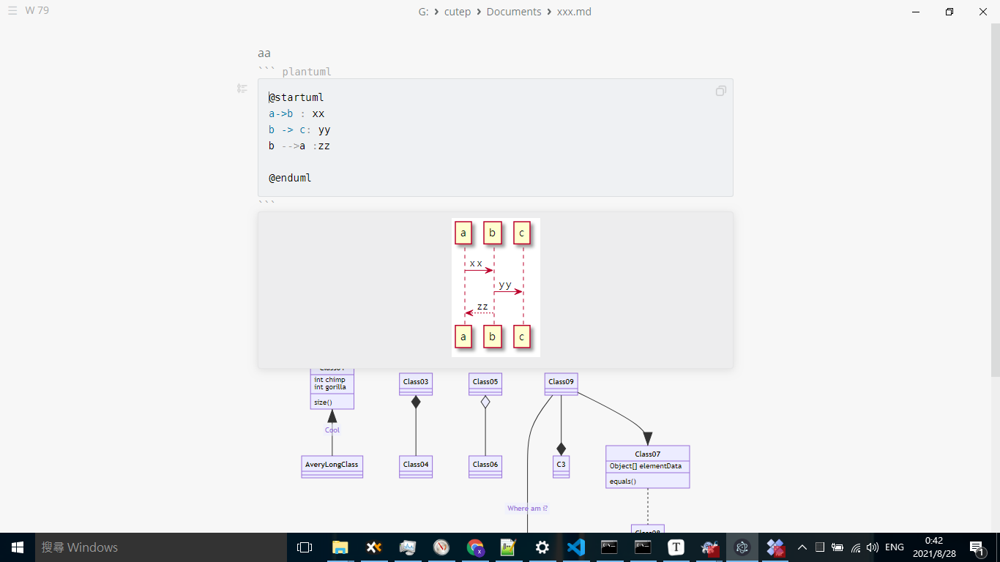

Steps

```bash
install Node.js >=v12.17 and yarn
install Python

git clone https://github.com/marktext/marktext.git
cd marktext
yarn install --frozen-lockfile
yarn run dev
```


There is a pull request which supporting plantuml @[link](https://github.com/marktext/marktext/pull/2625/commits)


Test PASS!




Ref

https://github.com/marktext/marktext/blob/develop/docs/dev/BUILD.md

