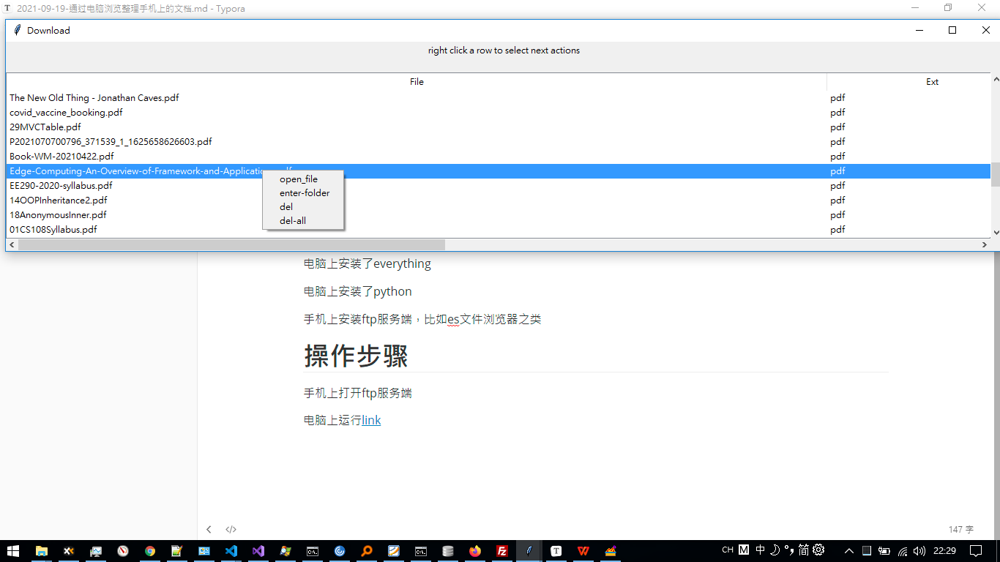

# 目的

手机或者平板操作文件还是不如电脑方便。能否通过电脑快速整理文件

要求：

列出平板上的文件

打开文件。如果文件在电脑上已经有了，直接打开电脑上的副本。否则下载到电脑再打开

删除文件

支持多选

# 前提条件

电脑上安装了everything

电脑上安装了python

手机上安装ftp服务端，比如es文件浏览器之类

# 操作步骤

手机上打开ftp服务端

电脑上运行[link](https://github.com/cutepig123/EventTraceVisualize/blob/master/utilFtp.py)

