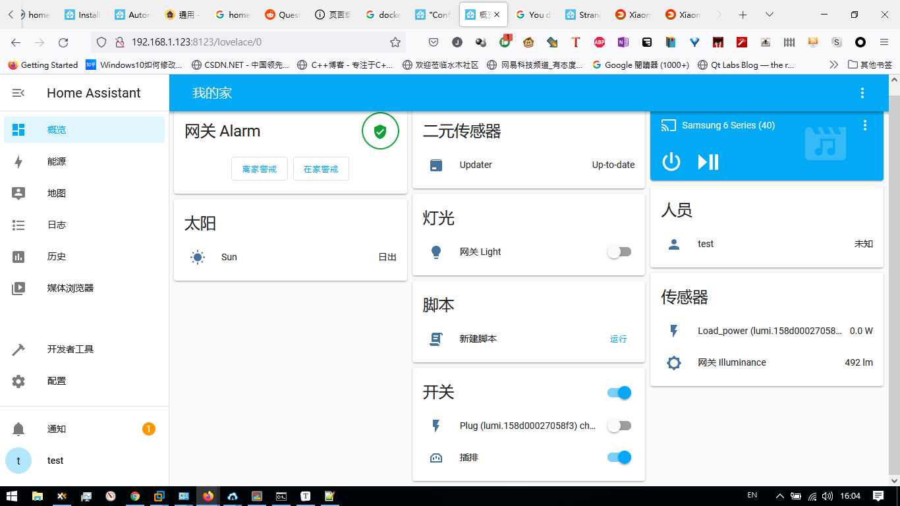
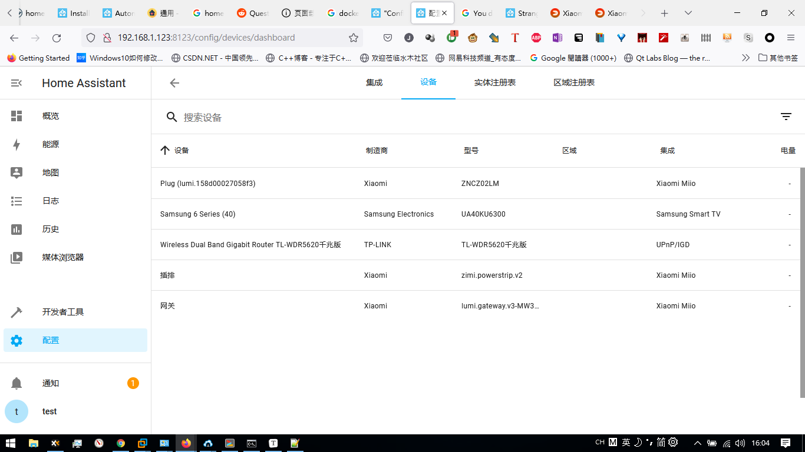

# 目的

研究一下有什么功能

# 软件

linux + ~~python3~~ + ~~docker~~

**一定要用HA的OS版本（VMWare虚拟机镜像）才能有“加载项”**以便安装Node Red之类的

HACS (home assitance的插件，方便加入一些别人弄好的配置仪表盘之类的)

# 使用步骤

```bash
# method 1
# use pip3
pip3 install homeassistant
# 报错 ERROR: Could not build wheels for cryptography
hass


# method2
# use docker
docker pull homeassistant/home-assistant

mkdir my-home-assistant-config
docker run -d --name="home-assistant" -v ~/my-home-assistant-config:/config -v /etc/localtime:/etc/localtime:ro --net=host homeassistant/home-assistant

# method 3: HA OS uses Virtual Machine

open http://192.168.1.124:8123/onboarding.html in chrome
```


How to solve ERROR: Could not build wheels for cryptography

```bash
# https://community.home-assistant.io/t/error-failed-building-wheel-for-cryptography/352020/4
sudo apt install cargo
export CRYPTOGRAPHY_DONT_BUILD_RUST=1

# error: command 'i686-linux-gnu-gcc' failed with exit status 1
sudo apt install libssl-dev

pip3 install --upgrade homeassistant

#  No module named 'aiohttp_cors'
pip3 install aiohttp_cors
```


# 我的家







# todo

- [ ] 把我现有的定时任务改到ha平台下面
- [ ] 小米摄像头能否加入homeassistant
- [ ] 树莓派加入ha
- [ ] nodemcu esp8266加入ha
- [ ] google calandar加入ha
- [ ] esp8266加入mijia
- [ ] 用个没用的手机，显示控制ha
- [ ] 显示每日股票推荐，股价情况?
- [ ] 显示摄像头视频备份状况
- [ ] 显示每日重要邮件信息
- [ ] 显示室内温度计情况
- [ ] 显示243m巴士到站，以及出站情况。通过如下api。https://data.gov.hk/tc-data/dataset/hk-td-tis_21-etakmb
- [ ] 显示电脑开关机状态
- [ ] 通过ip查询，显示家庭内部设备情况


# FAQ

ha定时执行脚本?
不建议这样做。因为ha os自带功能有限。建议通过notify，mqtt之类的将事件通知给外部服务


ha与外部服务的关系
ha作为前端，主要做ui显示，数据存储。外部服务作为后端无状态服务


ha如何作为mqtt pubhlisher
在integration搜索mqtt，。。。


ha如何作为rest api客户端
我在hacs里面找到一个python script模块。。不知道有无更直接的办法。有人说node red


ha作为restapi服务端
https://youtu.be/ZXTI286DwYQ
如何触发？
https://www.home-assistant.io/docs/automation/trigger/#webhook-trigger
curl -X POST -d '{ "key": "value" }' https://192.168.1.131:8123/api/webhook/testwebhook-id


tts?
https://github.com/hasscc/hass-edge-tts
【homeassistant的tts插件，声控福利-哔哩哔哩】 https://b23.tv/tZcREiz

esp8266 to ha by esphome
https://youtu.be/NGCUfZhxY9U


显示家庭内部设备情况?

https://github.com/bwaldvogel/neighbourhood


# Ref

https://home-assistant.cc/installation/docker/

