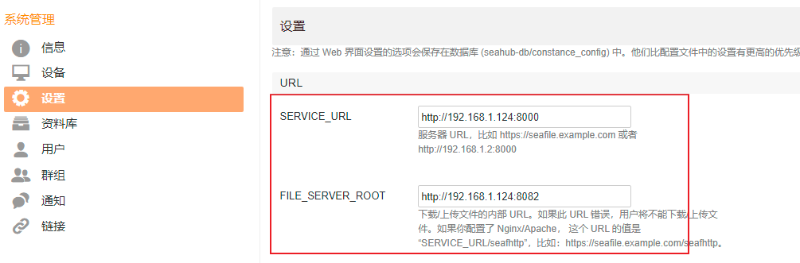

# 本文目標

- 背景：跑测试有很多test case （几十万个文件，文件有大有小）
- 功能要求：支持
  - 文件版本控制，
    - 最好：文件的修改需要显式提交（类似于git）这样能清晰地看到提交历史和原因
    - 类似于git有一个history，每一个commit对于整个文件系统有一个SHA1号码。可以快速 切换到任意版本
  - 有app映射成windows硬盤
  - 文件缓存：文件按需下载，可以设置最大缓存大小限制
- 测试过的软件
  - Git：文件一多客户端(我用的tutoisegit)操作非常慢。并且他把所有文件都下载下来太大了，本地空间不够大
  - seafile：一个云盘，他的文件缓存不错，但是文件版本控制是隐式的，没办法切换到

# seafile

https://github.com/haiwen/seafile

~~安裝，使用docker composer~~

~~https://download.seafile.com/published/seafile-manual/docker/deploy%20seafile%20with%20docker.md~~

使用docker安裝 [Link](https://cloud.tencent.com/developer/article/1751801)

```bash
sudo docker run -d --name seafile \
  -e SEAFILE_SERVER_HOSTNAME=seafile.example.com \
  -e SEAFILE_ADMIN_EMAIL=me@example.com \
  -e SEAFILE_ADMIN_PASSWORD=your_password \
  -v /opt/seafile-data:/shared \
  -p 8000:8000 \
  -p 8082:8082 \
  seafileltd/seafile:latest 
```

用如上email和密碼登錄http://192.168.1.124:8000

進入設置，修改(如果不設置就不能上傳文件成功)

```
SERVICE_URL http://192.168.1.124:8000
FILE_SERVER_ROOT http://192.168.1.124:8082
```




# owncloud

# svn