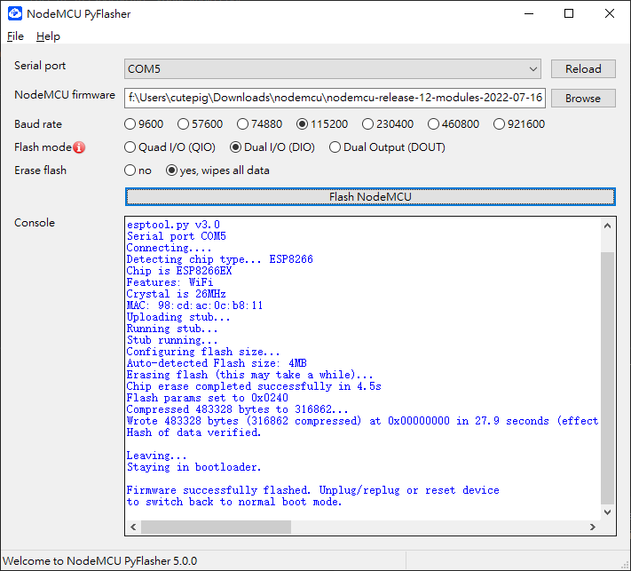

# 目的

本文介紹怎樣玩esp8266

# 概述

esp8266有如下固件

* Arlandu固件，用c寫代碼
* nodemcu，用lua寫代碼

# **nodemcu板子**

接口指南 https://zhuanlan.zhihu.com/p/477322369

# **Arduino固件**

https://zhuanlan.zhihu.com/p/477322369

dht11測量溫度

https://lights.ofweek.com/2020-10/ART-11000-2200-30463617.html

# nodemcu社區的固件

## Flash to esp8266

## lua編程以及測試

https://ghostyguo.pixnet.net/blog/post/168300185-%E4%BD%BF%E7%94%A8-esplorer-%E6%92%B0%E5%AF%AB-nodemcu-%E7%A8%8B%E5%BC%8F

led 測試

https://blog.csdn.net/tiandiren111/article/details/109040567

dht11

https://blog.csdn.net/CATTLE_L/article/details/91128601
