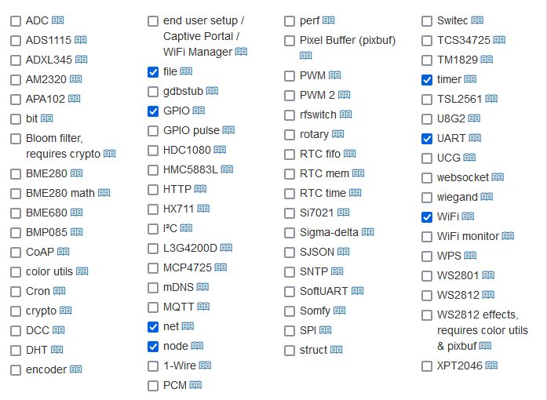
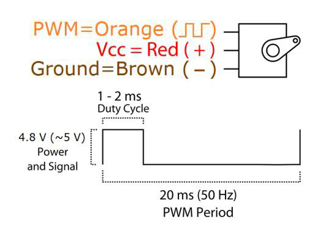

# 目的

本文介紹怎樣玩esp8266

# 概述

基于乐鑫esp8266的NodeMcu开发板，具有GPIO、PWM、I2C、1-Wire、ADC等功能，结合NodeMcu 固件为您的原型开发提供最快速的途径。

esp8266有如下固件

* Arlandu固件，用c寫代碼
* nodemcu，用lua寫代碼


# nodemcu lua编程指南

## 如何 [构建固件 ](https://nodemcu.readthedocs.io/en/release/build/)

这里可以看到支持的模块以及文档



## usb连接以及驱动安装

将esp8266通过usb2线连接到电脑

电脑安装CH340驱动，安装之后会在电脑的设备管理器有一个COM口出现

## 下载固件，以及flash到esp8266

参考如何 [刷入固件 ](https://nodemcu.readthedocs.io/en/release/flash/)以及如何 [上传代码和 NodeMCU IDE ](https://nodemcu.readthedocs.io/en/release/upload/)


## lua编程1：让板子上的灯闪烁

代码

```lua
-- 1.blink.lua
pin = 4 -- gpio pin
gpio.mode( pin, gpio.OUTPUT )
for i=1,100 do
    gpio.write( pin, gpio.LOW )
    tmr.delay( 500000 ) -- delay 0.5 second
    gpio.write( pin, gpio.HIGH )
    tmr.delay( 500000 ) -- delay 0.5 second
end
```

代码介绍。该灯连接到的是gpio4，代码首先设置该端口为输出端口（为什么要设置输入还是输出，好像跟电路相关，具体忘了那里讲过来着），然后代码

以上代码会hang住，因为他有个无限长的for loop。其实他还有一个timer的功能，这个是non blocking的

代码2：

```lua
pin = 4 -- gpio pin
gpio.mode( pin, gpio.OUTPUT )

value = gpio.LOW
local function blink()
    gpio.write( pin, value )

    if value == gpio.LOW then
        value = gpio.HIGH
    else
        value = gpio.LOW
    end
end

local function setuptimer(callback)
    local time1 = tmr.create() 
    time1:alarm(30, tmr.ALARM_AUTO, callback)
    return time1
end

setuptimer(blink)

```

## 编程2：DHT11温度测量

硬件简介：

| DHT22接腳 | NodeMCU接腳 |
| --------- | ----------- |
| VCC       | 3.3V        |
| GND       | GND         |
| Data      | D5          |

```lua
print('test dht')
Temp_Humi_Pin = 5   
time1 = tmr.create() 

function Acquire_Data()
   status,temp,humi,temp_dec,humi_dec = dht.read11(Temp_Humi_Pin)
   print("temp:"..temp,"  humi:"..humi) 
end


Acquire_Data()    
time1:alarm(1500, tmr.ALARM_AUTO, Acquire_Data)
```

Remarks: dht是自己的私有协议，有人用lua写了测试程序可以看看

[使用 ESPlorer 撰寫 NodeMCU 程式 @ No More Codes :: 痞客邦 :: (pixnet.net)](https://ghostyguo.pixnet.net/blog/post/168300185-使用-esplorer-撰寫-nodemcu-程式)

他的标准库在这类

https://github.com/nodemcu/nodemcu-firmware/blob/release/app/dht/dht.h

关于代码为什么这么写，建议找个dht11的[spec](https://www.google.com/url?sa=t&rct=j&q=&esrc=s&source=web&cd=&cad=rja&uact=8&ved=2ahUKEwjMl4DHs5z-AhVPqVYBHbfJBe4QFnoECAoQAQ&url=https%3A%2F%2Fcdn-shop.adafruit.com%2Fdatasheets%2FDHT11-chinese.pdf&usg=AOvVaw18Xf1o-YYgn-emtWSMopOy)看一下 

led 測試

https://blog.csdn.net/tiandiren111/article/details/109040567

dht11

https://blog.csdn.net/CATTLE_L/article/details/91128601

## 编程3：4针OLED使用

硬件简介：

该led使用i2c接口，esp8266又一个i2c的库，使用软件实现了i2c接口。用户需要置顶sda, scl两条线的引脚名

测试代码：

```lua
  -- 管脚定义
    local sda = 2 
    local scl = 1
    local sla = 0x3c  -- oled的地址，一般为0x3c
    -- 初始化
    function init_oled()
        -- iic总线 和 oled初始化
        i2c.setup(0, sda, scl, i2c.SLOW)
        disp = u8g2.ssd1306_i2c_128x64_noname(0, sla)
        -- 设置字体
        disp:setFont(u8g2.font_unifont_t_symbols)
        disp:setFontRefHeightExtendedText()
        --disp:setDrawColor(1)
        disp:setFontPosTop()
        --disp:setFontDirection(0)
        -- 画边框
        --disp:drawFrame(0, 0, 128, 64)
    end
    -- 显示函数
    function oled_show_msg()
        -- 设置显示内容
        disp:drawStr(0, 0,  "1 Hello OLED")
        disp:drawStr(0, 16, "1234567890123456789")
        disp:drawStr(0, 32, "Li Jing Jing")
        disp:drawStr(0, 48, "He Jin Shou")
        -- 将内容发送到oled
        disp:sendBuffer()
    end
    -- 主函数
    function main()
        init_oled()
        oled_show_msg()
    end
    -- 运行程序
    main()

```

https://github.com/nodemcu/nodemcu-firmware/blob/136e09739b835d6dcdf04034141d70ab755468c6/app/modules/u8g2.c

## 编程4：ch-sr04超声测距

硬件信息


引脚连接

除了gcc, gnd之外，trig连接D7,echo连接d6

```lua
--[[
// Clears the trigPin
digitalWrite(trigPin, LOW);
delayMicroseconds(2);

// Sets the trigPin on HIGH state for 10 micro seconds
digitalWrite(trigPin, HIGH);
delayMicroseconds(10);
digitalWrite(trigPin, LOW);

// Reads the echoPin, returns the sound wave travel time in microseconds
duration = pulseIn(echoPin, HIGH);

// Calculating the distance
distance= duration*0.034/2;
// Prints the distance on the Serial Monitor
Serial.print("Distance: ");
Serial.println(distance);
delay(2000);
]]

trigPin = 7
echoPin = 6
LOW = gpio.LOW
HIGH = gpio.HIGH

function digitalWrite(pin, value)
    --gpio.mode( pin, gpio.OUTPUT )
    gpio.write( pin, value )
end

function delayMicroseconds(ms)
    tmr.delay(ms)
end

function pulseIn(pin)
    gpio.mode( pin, gpio.INPUT )
    while gpio.read( pin ) ~= HIGH do
        tmr.delay(1)
    end

    local t1 = tmr.now()
    while gpio.read( pin ) == HIGH do
        tmr.delay(1)
    end
    local t2 = tmr.now()

    return t2-t1
end

function measure()
    --// Clears the trigPin
    gpio.mode( trigPin, gpio.OUTPUT )
    digitalWrite(trigPin, LOW);
    delayMicroseconds(2);

    --// Sets the trigPin on HIGH state for 10 micro seconds
    digitalWrite(trigPin, HIGH);
    delayMicroseconds(10);
    digitalWrite(trigPin, LOW);

    --// Reads the echoPin, returns the sound wave travel time in microseconds
    duration = pulseIn(echoPin);
    --print('duration', duration)

    --// Calculating the distance
    --distance= duration * 0.034/2.0;
    --// Prints the distance on the Serial Monitor
    --print("Distance: ", distance);
    print('duration', duration, 'distance is', duration / 58, 'cm')
end

local function setuptimer(callback)
    local time1 = tmr.create() 
    time1:alarm(1000, tmr.ALARM_AUTO, callback)
    return time1
end


setuptimer(measure)

```

参考资料

[用8266学习单片机-13-HC-SR04超声波模块测距示例-Ultrasonic-US-015_esphome声波测距校准_Kearney form An idea的博客-CSDN博客](https://blog.csdn.net/weixin_43031092/article/details/106899984)

## 编程5：sg50私服马达控制

硬件简介

连线



我的连线为

- PWm连接D4

代码

```lua
pin = 4
-- set pin index 1 as pwm output, frequency is 50Hz, 
pwm.setup(pin, 50, 1024*3/40)
pwm.start(pin)

-- Position 0
-- 20ms cycle, High duration is 20ms * 7.5% = 1.5ms
for i=1,2,0.1 do
    -- pwm.setduty(pin, duty)：duty 0~1023, pwm duty cycle, max 1023 (10bit)
    pwm.setduty(pin, 1024*i/20)
    print(tmr.now())
    tmr.delay(1000000)
end
```


# referece

## **nodemcu板子**

接口指南 https://zhuanlan.zhihu.com/p/477322369


## **Arduino固件**

https://zhuanlan.zhihu.com/p/477322369

dht11測量溫度

https://lights.ofweek.com/2020-10/ART-11000-2200-30463617.html

nodemcu 固件

https://ghostyguo.pixnet.net/blog/post/168300185-%E4%BD%BF%E7%94%A8-esplorer-%E6%92%B0%E5%AF%AB-nodemcu-%E7%A8%8B%E5%BC%8F

# ESP8266开发板NodeMCU 资料:

链接: https://pan.baidu.com/s/1n8gJToN1acbyyiwZ5Jvcsw 提取码: ni62
NodeMCU 烧录固件教程：https://www.cnblogs.com/0pen1/p/12592906.html

# DHT11温湿度教程

https://www.jianshu.com/p/3aba3ce1ad12

1.44 Arduino黑色+ESP8266黑色开发板：
http://www.lcdwiki.com/zh/1.44inch_SPI_Arduino_Module_Black_SKU:MAR1442 
这个是单独另外参考资料
学习资料免费链接: https://pan.baidu.com/s/1TRTU1f-35HpKSUEhKegHKQ  提取码: vttk 

# ESP826 6针OLED

ESP826 6针OLED：https://blog.csdn.net/weixin_45631738/article/details/105961924
4针OLED：
https://blog.csdn.net/weixin_42268054/article/details/104254955?utm_medium=distribute.pc_relevant.none-task-blog-BlogCommendFromMachineLearnPai2-2.channel_param&depth_1-utm_source=distribute.pc_relevant.none-task-blog-BlogCommendFromMachineLearnPai2-2.channel_param

ESP8266开发板OLED链接: https://pan.baidu.com/s/1fDAF_-fAYEO6jh0c-FaYqg 提取码: 4k2s 复
OLED烧录教程：https://blog.csdn.net/weixin_45611006/article/details/109399946（简单说可以提示手动安装这个库
只需要安装ssd1306和u8g2的库就可以，写程序只要调用就可以了）

# ESP8266开发板+SG90舵机教程

ESP8266开发板+SG90舵机教程：https://blog.csdn.net/weixin_42268054/article/details/104735122
舵机如果只有90度
Servo库的默认脉冲时间为544-2400 μs(即 servo.attach(Servo_pin,544,2400))，而实际需要的脉冲为500-2500 μs,因此我们改一下默认的attach()定义就好了。
因此将servo.attach(Servo_pin)改成servo.attach(Servo_pin,500,2500)就大功告成了。

OLED教程是倒数第2网盘

# esp8266玩法总结

。使用arduino  ide，参考教程，youtube https://youtu.be/29dfYc4Xldk
。nodemcu固件，使用ESPlorer程序，直接lua编程
。esphome固件，不用编程，直接用yaml配置和ha通信

# 通过 NodeMCU 使用 HC-SR04 进行距离测量 

https://www.instructables.com/Distance-Measurement-Using-HC-SR04-Via-NodeMCU/

https://blog.csdn.net/weixin_43031092/article/details/106899984

https://randomnerdtutorials.com/esp8266-nodemcu-hc-sr04-ultrasonic-arduino/

https://atceiling.blogspot.com/2017/03/arduino_28.html

https://github.com/loiphin/ESP8266/blob/master/hcsr04.lua

https://github.com/vsserafim/hcsr04-nodemcu/blob/master/hcsr04-simple.lua

https://blog.csdn.net/lzlxlzy/article/details/123614107

https://stackoverflow.com/questions/32428274/nodemcu-esp8266-hc-sr04-tmr-now-difference-is-incorrect

