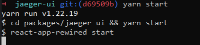
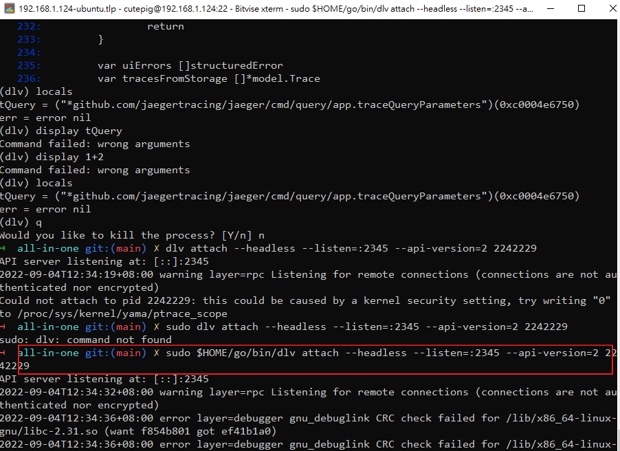
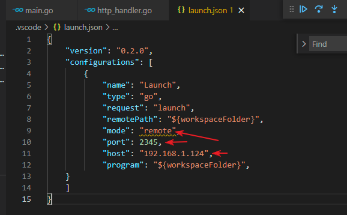
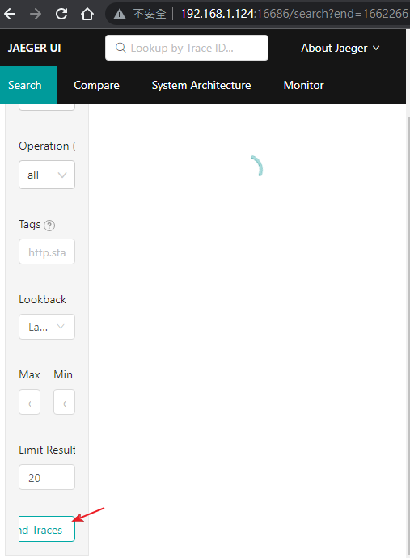
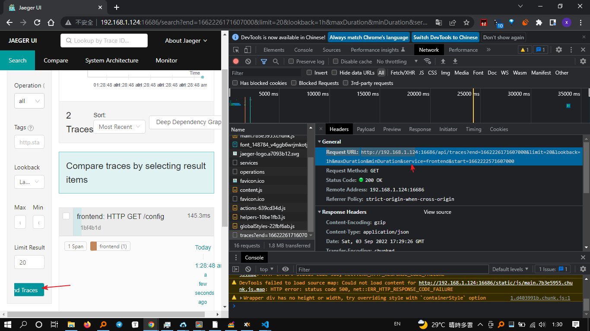

内容用分爲兩部分，這兩個是獨立的。如果只是想修改jaeger ui，那麽只需要參考how to setup jaeger ui。如果需要編譯整個jarger，包含jaegerui，那麽參考how to setup jaeger all in one

# 步驟截圖

```bash
export PATH=$PATH:/usr/local/go/bin:$HOME/go/bin

cd /home/cutepig/jaeger/jaeger-ui
yarn start &


cd /home/cutepig/jaeger/cmd/all-in-one
./main &

cd /home/cutepig/jaeger/examples/hotrod
./main all &

 sudo lsof -i -P -n | grep LISTEN
dlv attach --headless --api-version=2 --listen=:2345 8807
#sudo $HOME/go/bin/dlv attach --headless --api-version=2 --listen=:2345 8807

visit http://192.168.1.124:3000/
visit http://192.168.1.124:8080/
```


## 服務端

### 啓動hotrod

```bash
➜  hotrod git:(main) ✗ ./main all
2022-09-04T11:53:34.626+0800    INFO    cobra@v1.5.0/command.go:902     Using expvar as metrics backend
2022-09-04T11:53:34.628+0800    INFO    cobra@v1.5.0/command.go:872     Starting all services
2022-09-04T11:53:34.732+0800    INFO    tracing/init.go:70      debug logging disabled  {"service":
```


### 啓動jaegerui



### 啓動jaeger all in one，attach debugger




## 客戶端

### 設置vscode



設置斷點


### 連接jaegerui




# how to setup jaeger ui

jaeger ui的設置挺複雜的，首先按照他的指引clone代碼，然後要安裝node, nvm, yarn, ...

build完之後運行方法

- 方法1：運行jaegerallinone確保開啓jaeger query在16686端口，然後yarn start運行jaegerui在3000端口。客戶端直接訪問3000端口即可
- 方法2：yarn build到js之後，運行jaegerallinone確保開啓jaeger query在16686端口，運行nginx將api proxy到16686端口，將主頁這是為yarn build的輸出目錄

# how to setup jaeger all in one

```bash
# Install go
# https://go.dev/doc/install
wget https://go.dev/dl/go1.19.linux-amd64.tar.gz
rm -rf /usr/local/go && tar -C /usr/local -xzf go1.19.linux-amd64.tar.gz
export PATH=$PATH:/usr/local/go/bin:$HOME/go/bin
go version

# clone jarger and build it
git clone https://github.com/jaegertracing/jaeger.git
cd jaeger
git submodule update --init
make build-binaries-windows
```

# how to setup HotROD test program

```bash
cd jaeger
go run ./examples/hotrod/main.go all
```

# 分析HotROD 

他是一個前後端分離的項目

前端點一下會發送如下消息

`http://192.168.1.124:8080/dispatch?customer=731&nonse=0.6150827674931023`

他的後端處理為`https://github.com/jaegertracing/jaeger/blob/7872d1b07439c3f2d316065b1fd53e885b26a66f/examples/hotrod/services/frontend/server.go`

```bash

```


# 分析jaeger query

按下搜索之後，如下圖。我們發現會發送如下request，而返回的response為符合條件的trace以及詳細數據

```
http://192.168.1.124:16686/api/traces?end=1662226171607000&limit=20&lookback=1h&maxDuration&minDuration&service=frontend&start=1662222571607000

{"data":[{"traceID":"1bf4b1db7435d604","spans":[{"traceID":"1bf4b1db7435d604","spanID":"1bf4b1db7435d604","flags":1,"operationName":"HTTP GET /config","references":[],"startTime":1662226128607699,"duration":145295,"tags":[{"key":"sampler.type","type":"string","value":"const"},{"key":"sampler.param","type":"bool","value":true},{"key":"span.kind","type":"string","value":"server"},{"key":"http.method","type":"string","value":"GET"},{"key":"http.url","type":"string","value":"/config?nonse=0.3114192724497855"},{"key":"component","type":"string","value":"net/http"},{"key":"http.status_code","type":"int64","value":200},{"key":"internal.span.format","type":"string","value":"proto"}],"logs":[],"processID":"p1","warnings":null}],"processes":{"p1":{"serviceName":"frontend","tags":[{"key":"client-uuid","type":"string","value":"475a390b81eadaaf"},{"key":"hostname","type":"string","value":"cutepig-Standard-PC-i440FX-PIIX-1996"},{"key":"ip","type":"string","value":"192.168.1.124"},{"key":"jaeger.version","type":"string","value":"Go-2.30.0"}]}},"warnings":null},{"traceID":"18e58c2bf1e85fa7","spans":[{"traceID":"18e58c2bf1e85fa7","spanID":"436fdca8dd2cf1b1","flags":1,"operationName":"/driver.DriverService/FindNearest","references":[{"refType":"CHILD_OF","traceID":"18e58c2bf1e85fa7","spanID":"0f8cf1ca061980f6"}],"startTime":1662226129804176,"duration":313668,"tags":[{"key":"span.kind","type":"string","value":"server"},{"key":"component","type":"string","value":"gRPC"},{"key":"internal.span.format","type":"string","value":"proto"}],"logs":[{"timestamp":1662226129873713,"fields":[{"key":"event","type":"string","value":"Searching for nearby drivers"},{"key":"level","type":"string","value":"info"},{"key":"location","type":"string","value":"728,326"}]},{"timestamp":1662226129994208,"fields":[{"key":"event","type":"string","value":"Retrying GetDriver after error"},{"key":"error","type":"string","value":"redis timeout"},{"key":"level","type":"string","value":"error"},{"key":"retry_no","type":"int64","value":1}]},{"timestamp":1662226130077116,"fields":[{"key":"event","type":"string","value":"Retrying GetDriver after error"},{"key":"error","type":"string","value":"redis timeout"},{"key":"level","type":"string","value":"error"},{"key":"retry_no","type":"int64","value":1}]},{"timestamp":1662226130117115,"fields":[{"key":"event","type":"string","value":"Search successful"},{"key":"level","type":"string","value":"info"},{"key":"num_drivers","type":"int64","value":10}]}],"processID":"p1","warnings":null},{"traceID":"18e58c2bf1e85fa7","spanID":"0443970bcf1daea1","flags":1,"operationName":"HTTP GET /customer","references":[{"refType":"CHILD_OF","traceID":"18e58c2bf1e85fa7","spanID":"5d1de229cd6dfa5c"}],"startTime":1662226129399387,"duration":337927,"tags":[{"key":"span.kind","type":"string","value":"server"},{"key":"http.method","type":"string","value":"GET"},{"key":"http.url","type":"string","value":"/customer?customer=731"},{"key":"component","type":"string","value":"net/http"},{"key":"http.status_code","type":"int64","value":200},{"key":"internal.span.format","type":"string","value":"proto"}],"logs":[{"timestamp":1662226129412664,"fields":[{"key":"event","type":"string","value":"HTTP request received"},{"key":"level","type":"string","value":"info"},{"key":"method","type":"string","value":"GET"},{"key":"url","type":"string","value":"/customer?customer=731"}]},{"timestamp":1662226129427930,"fields":[{"key":"event","type":"string","value":"Loading customer"},{"key":"customer_id","type":"string","value":"731"},{"key":"level","type":"string","value":"info"}]}],"processID":"p2","warnings":null},{"traceID":"18e58c2bf1e85fa7","spanID":"0f8cf1ca061980f6","flags":1,"operationName":"/driver.DriverService/FindNearest","references":[{"refType":"CHILD_OF","traceID":"18e58c2bf1e85fa7","spanID":"18e58c2bf1e85fa7"}],"startTime":1662226129756678,"duration":399093,"tags":[{"key":"component","type":"string","value":"gRPC"},{"key":"span.kind","type":"string","value":"client"},{"key":"internal.span.format","type":"string","value":"proto"}],"logs":[],"processID":"p3","warnings":null},{"traceID":"18e58c2bf1e85fa7","spanID":"3322f0863e7cfa1c","flags":1,"operationName":"SQL SELECT","references":[{"refType":"CHILD_OF","traceID":"18e58c2bf1e85fa7","spanID":"0443970bcf1daea1"}],"startTime":1662226129450304,"duration":286944,"tags":[{"key":"span.kind","type":"string","value":"client"},{"key":"peer.service","type":"string","value":"mysql"},{"key":"sql.query","type":"string","value":"SELECT * FROM customer WHERE customer_id=731"},{"key":"request","type":"string","value":"2415-5"},{"key":"internal.span.format","type":"string","value":"proto"}],"logs":[{"timestamp":1662226129450383,"fields":[{"key":"event","type":"string","value":"Acquired lock with 0 transactions waiting behind"}]}],"processID":"p4","warnings":null},{"traceID":"18e58c2bf1e85fa7","spanID":"5d1de229cd6dfa5c","flags":1,"operationName":"HTTP GET","references":[{"refType":"CHILD_OF","traceID":"18e58c2bf1e85fa7","spanID":"17d2c753d70ce4eb"}],"startTime":1662226129080687,"duration":657051,"tags":[{"key":"span.kind","type":"string","value":"client"},{"key":"component","type":"string","value":"net/http"},{"key":"http.method","type":"string","value":"GET"},{"key":"http.url","type":"string","value":"http://0.0.0.0:8081/customer?customer=731"},{"key":"http.url","type":"string","value":"0.0.0.0:8081"},{"key":"net/http.reused","type":"bool","value":false},{"key":"net/http.was_idle","type":"bool","value":false},{"key":"http.status_code","type":"int64","value":200},{"key":"internal.span.format","type":"string","value":"proto"}],"logs":[{"timestamp":1662226129080772,"fields":[{"key":"event","type":"string","value":"GetConn"}]},{"timestamp":1662226129163515,"fields":[{"key":"event","type":"string","value":"ConnectStart"},{"key":"addr","type":"string","value":"0.0.0.0:8081"},{"key":"network","type":"string","value":"tcp"}]},{"timestamp":1662226129268263,"fields":[{"key":"event","type":"string","value":"ConnectDone"},{"key":"addr","type":"string","value":"0.0.0.0:8081"},{"key":"network","type":"string","value":"tcp"}]},{"timestamp":1662226129357965,"fields":[{"key":"event","type":"string","value":"GotConn"}]},{"timestamp":1662226129358147,"fields":[{"key":"event","type":"string","value":"WroteHeaders"}]},{"timestamp":1662226129358156,"fields":[{"key":"event","type":"string","value":"WroteRequest"}]},{"timestamp":1662226129737631,"fields":[{"key":"event","type":"string","value":"GotFirstResponseByte"}]},{"timestamp":1662226129737701,"fields":[{"key":"event","type":"string","value":"PutIdleConn"}]},{"timestamp":1662226129737735,"fields":[{"key":"event","type":"string","value":"ClosedBody"}]}],"processID":"p3","warnings":null},{"traceID":"18e58c2bf1e85fa7","spanID":"17d2c753d70ce4eb","flags":1,"operationName":"HTTP GET: /customer","references":[{"refType":"CHILD_OF","traceID":"18e58c2bf1e85fa7","spanID":"18e58c2bf1e85fa7"}],"startTime":1662226129036512,"duration":701231,"tags":[{"key":"internal.span.format","type":"string","value":"proto"}],"logs":[],"processID":"p3","warnings":null},{"traceID":"18e58c2bf1e85fa7","spanID":"4addf10ebb803713","flags":1,"operationName":"FindDriverIDs","references":[{"refType":"CHILD_OF","traceID":"18e58c2bf1e85fa7","spanID":"436fdca8dd2cf1b1"}],"startTime":1662226129874450,"duration":61171,"tags":[{"key":"param.location","type":"string","value":"728,326"},{"key":"span.kind","type":"string","value":"client"},{"key":"internal.span.format","type":"string","value":"proto"}],"logs":[{"timestamp":1662226129933523,"fields":[{"key":"event","type":"string","value":"Found drivers"},{"key":"level","type":"string","value":"info"}]}],"processID":"p5","warnings":null},{"traceID":"18e58c2bf1e85fa7","spanID":"4ece45aed385c6e9","flags":1,"operationName":"GetDriver","references":[{"refType":"CHILD_OF","traceID":"18e58c2bf1e85fa7","spanID":"436fdca8dd2cf1b1"}],"startTime":1662226129935659,"duration":19226,"tags":[{"key":"param.driverID","type":"string","value":"T755701C"},{"key":"span.kind","type":"string","value":"client"},{"key":"internal.span.format","type":"string","value":"proto"}],"logs":[],"processID":"p5","warnings":null},{"traceID":"18e58c2bf1e85fa7","spanID":"5e6dda7fd42abd91","flags":1,"operationName":"GetDriver","references":[{"refType":"CHILD_OF","traceID":"18e58c2bf1e85fa7","spanID":"436fdca8dd2cf1b1"}],"startTime":1662226129954916,"duration":8287,"tags":[{"key":"param.driverID","type":"string","value":"T754335C"},{"key":"span.kind","type":"string","value":"client"},{"key":"internal.span.format","type":"string","value":"proto"}],"logs":[],"processID":"p5","warnings":null},{"traceID":"18e58c2bf1e85fa7","spanID":"52e5de4f6ef134da","flags":1,"operationName":"GetDriver","references":[{"refType":"CHILD_OF","traceID":"18e58c2bf1e85fa7","spanID":"436fdca8dd2cf1b1"}],"startTime":1662226129963229,"duration":30920,"tags":[{"key":"param.driverID","type":"string","value":"T792438C"},{"key":"span.kind","type":"string","value":"client"},{"key":"error","type":"bool","value":true},{"key":"internal.span.format","type":"string","value":"proto"}],"logs":[{"timestamp":1662226129993153,"fields":[{"key":"event","type":"string","value":"redis timeout"},{"key":"driver_id","type":"string","value":"T792438C"},{"key":"error","type":"string","value":"redis timeout"},{"key":"level","type":"string","value":"error"}]}],"processID":"p5","warnings":null},{"traceID":"18e58c2bf1e85fa7","spanID":"07298d5b9d3a98a6","flags":1,"operationName":"GetDriver","references":[{"refType":"CHILD_OF","traceID":"18e58c2bf1e85fa7","spanID":"436fdca8dd2cf1b1"}],"startTime":1662226129994510,"duration":12482,"tags":[{"key":"param.driverID","type":"string","value":"T792438C"},{"key":"span.kind","type":"string","value":"client"},{"key":"internal.span.format","type":"string","value":"proto"}],"logs":[],"processID":"p5","warnings":null},{"traceID":"18e58c2bf1e85fa7","spanID":"577dc09c7a32ddcb","flags":1,"operationName":"GetDriver","references":[{"refType":"CHILD_OF","traceID":"18e58c2bf1e85fa7","spanID":"436fdca8dd2cf1b1"}],"startTime":1662226130007023,"duration":7407,"tags":[{"key":"param.driverID","type":"string","value":"T745468C"},{"key":"span.kind","type":"string","value":"client"},{"key":"internal.span.format","type":"string","value":"proto"}],"logs":[],"processID":"p5","warnings":null},{"traceID":"18e58c2bf1e85fa7","spanID":"226704a934853402","flags":1,"operationName":"GetDriver","references":[{"refType":"CHILD_OF","traceID":"18e58c2bf1e85fa7","spanID":"436fdca8dd2cf1b1"}],"startTime":1662226130014462,"duration":12501,"tags":[{"key":"param.driverID","type":"string","value":"T725683C"},{"key":"span.kind","type":"string","value":"client"},{"key":"internal.span.format","type":"string","value":"proto"}],"logs":[],"processID":"p5","warnings":null},{"traceID":"18e58c2bf1e85fa7","spanID":"7b39c10685109920","flags":1,"operationName":"GetDriver","references":[{"refType":"CHILD_OF","traceID":"18e58c2bf1e85fa7","spanID":"436fdca8dd2cf1b1"}],"startTime":1662226130026994,"duration":14581,"tags":[{"key":"param.driverID","type":"string","value":"T771889C"},{"key":"span.kind","type":"string","value":"client"},{"key":"internal.span.format","type":"string","value":"proto"}],"logs":[],"processID":"p5","warnings":null},{"traceID":"18e58c2bf1e85fa7","spanID":"608bfbce2331a419","flags":1,"operationName":"GetDriver","references":[{"refType":"CHILD_OF","traceID":"18e58c2bf1e85fa7","spanID":"436fdca8dd2cf1b1"}],"startTime":1662226130041620,"duration":35444,"tags":[{"key":"param.driverID","type":"string","value":"T738261C"},{"key":"span.kind","type":"string","value":"client"},{"key":"error","type":"bool","value":true},{"key":"internal.span.format","type":"string","value":"proto"}],"logs":[{"timestamp":1662226130076287,"fields":[{"key":"event","type":"string","value":"redis timeout"},{"key":"driver_id","type":"string","value":"T738261C"},{"key":"error","type":"string","value":"redis timeout"},{"key":"level","type":"string","value":"error"}]}],"processID":"p5","warnings":null},{"traceID":"18e58c2bf1e85fa7","spanID":"475b3c1c94434c73","flags":1,"operationName":"GetDriver","references":[{"refType":"CHILD_OF","traceID":"18e58c2bf1e85fa7","spanID":"436fdca8dd2cf1b1"}],"startTime":1662226130077479,"duration":13294,"tags":[{"key":"param.driverID","type":"string","value":"T738261C"},{"key":"span.kind","type":"string","value":"client"},{"key":"internal.span.format","type":"string","value":"proto"}],"logs":[],"processID":"p5","warnings":null},{"traceID":"18e58c2bf1e85fa7","spanID":"4482b33c181ab956","flags":1,"operationName":"GetDriver","references":[{"refType":"CHILD_OF","traceID":"18e58c2bf1e85fa7","spanID":"436fdca8dd2cf1b1"}],"startTime":1662226130090812,"duration":6273,"tags":[{"key":"param.driverID","type":"string","value":"T759127C"},{"key":"span.kind","type":"string","value":"client"},{"key":"internal.span.format","type":"string","value":"proto"}],"logs":[],"processID":"p5","warnings":null},{"traceID":"18e58c2bf1e85fa7","spanID":"2bb3dbde545066d6","flags":1,"operationName":"GetDriver","references":[{"refType":"CHILD_OF","traceID":"18e58c2bf1e85fa7","spanID":"436fdca8dd2cf1b1"}],"startTime":1662226130097105,"duration":7100,"tags":[{"key":"param.driverID","type":"string","value":"T765950C"},{"key":"span.kind","type":"string","value":"client"},{"key":"internal.span.format","type":"string","value":"proto"}],"logs":[],"processID":"p5","warnings":null},{"traceID":"18e58c2bf1e85fa7","spanID":"10a6ff497eef0890","flags":1,"operationName":"GetDriver","references":[{"refType":"CHILD_OF","traceID":"18e58c2bf1e85fa7","spanID":"436fdca8dd2cf1b1"}],"startTime":1662226130104236,"duration":12826,"tags":[{"key":"param.driverID","type":"string","value":"T714990C"},{"key":"span.kind","type":"string","value":"client"},{"key":"internal.span.format","type":"string","value":"proto"}],"logs":[],"processID":"p5","warnings":null},{"traceID":"18e58c2bf1e85fa7","spanID":"18e58c2bf1e85fa7","flags":1,"operationName":"HTTP GET /dispatch","references":[],"startTime":1662226128502575,"duration":2468003,"tags":[{"key":"sampler.type","type":"string","value":"const"},{"key":"sampler.param","type":"bool","value":true},{"key":"span.kind","type":"string","value":"server"},{"key":"http.method","type":"string","value":"GET"},{"key":"http.url","type":"string","value":"/dispatch?customer=731\u0026nonse=0.4962579869506296"},{"key":"component","type":"string","value":"net/http"},{"key":"http.status_code","type":"int64","value":200},{"key":"internal.span.format","type":"string","value":"proto"}],"logs":[{"timestamp":1662226128901034,"fields":[{"key":"event","type":"string","value":"HTTP request received"},{"key":"level","type":"string","value":"info"},{"key":"method","type":"string","value":"GET"},{"key":"url","type":"string","value":"/dispatch?customer=731\u0026nonse=0.4962579869506296"}]},{"timestamp":1662226128993927,"fields":[{"key":"event","type":"string","value":"Getting customer"},{"key":"customer_id","type":"string","value":"731"},{"key":"level","type":"string","value":"info"}]},{"timestamp":1662226129737764,"fields":[{"key":"event","type":"string","value":"Found customer"},{"key":"level","type":"string","value":"info"}]},{"timestamp":1662226129738579,"fields":[{"key":"event","type":"string","value":"baggage"},{"key":"key","type":"string","value":"customer"},{"key":"value","type":"string","value":"Japanese Desserts"}]},{"timestamp":1662226129738603,"fields":[{"key":"event","type":"string","value":"Finding nearest drivers"},{"key":"level","type":"string","value":"info"},{"key":"location","type":"string","value":"728,326"}]},{"timestamp":1662226130155810,"fields":[{"key":"event","type":"string","value":"Found drivers"},{"key":"level","type":"string","value":"info"}]},{"timestamp":1662226130158052,"fields":[{"key":"event","type":"string","value":"Finding route"},{"key":"dropoff","type":"string","value":"728,326"},{"key":"level","type":"string","value":"info"},{"key":"pickup","type":"string","value":"68,356"}]},{"timestamp":1662226130172349,"fields":[{"key":"event","type":"string","value":"Finding route"},{"key":"dropoff","type":"string","value":"728,326"},{"key":"level","type":"string","value":"info"},{"key":"pickup","type":"string","value":"652,333"}]},{"timestamp":1662226130199326,"fields":[{"key":"event","type":"string","value":"Finding route"},{"key":"dropoff","type":"string","value":"728,326"},{"key":"level","type":"string","value":"info"},{"key":"pickup","type":"string","value":"355,403"}]},{"timestamp":1662226130473844,"fields":[{"key":"event","type":"string","value":"Finding route"},{"key":"dropoff","type":"string","value":"728,326"},{"key":"level","type":"string","value":"info"},{"key":"pickup","type":"string","value":"985,941"}]},{"timestamp":1662226130513718,"fields":[{"key":"event","type":"string","value":"Finding route"},{"key":"dropoff","type":"string","value":"728,326"},{"key":"level","type":"string","value":"info"},{"key":"pickup","type":"string","value":"598,565"}]},{"timestamp":1662226130557295,"fields":[{"key":"event","type":"string","value":"Finding route"},{"key":"dropoff","type":"string","value":"728,326"},{"key":"level","type":"string","value":"info"},{"key":"pickup","type":"string","value":"824,884"}]},{"timestamp":1662226130598996,"fields":[{"key":"event","type":"string","value":"Finding route"},{"key":"dropoff","type":"string","value":"728,326"},{"key":"level","type":"string","value":"info"},{"key":"pickup","type":"string","value":"272,962"}]},{"timestamp":1662226130601131,"fields":[{"key":"event","type":"string","value":"Finding route"},{"key":"dropoff","type":"string","value":"728,326"},{"key":"level","type":"string","value":"info"},{"key":"pickup","type":"string","value":"231,994"}]},{"timestamp":1662226130744050,"fields":[{"key":"event","type":"string","value":"Finding route"},{"key":"dropoff","type":"string","value":"728,326"},{"key":"level","type":"string","value":"info"},{"key":"pickup","type":"string","value":"502,636"}]},{"timestamp":1662226130785474,"fields":[{"key":"event","type":"string","value":"Finding route"},{"key":"dropoff","type":"string","value":"728,326"},{"key":"level","type":"string","value":"info"},{"key":"pickup","type":"string","value":"818,35"}]},{"timestamp":1662226130968827,"fields":[{"key":"event","type":"string","value":"Found routes"},{"key":"level","type":"string","value":"info"}]},{"timestamp":1662226130970113,"fields":[{"key":"event","type":"string","value":"Dispatch successful"},{"key":"driver","type":"string","value":"T754335C"},{"key":"eta","type":"string","value":"2m0s"},{"key":"level","type":"string","value":"info"}]}],"processID":"p3","warnings":null},{"traceID":"18e58c2bf1e85fa7","spanID":"5d57e468e1d42729","flags":1,"operationName":"HTTP GET","references":[{"refType":"CHILD_OF","traceID":"18e58c2bf1e85fa7","spanID":"236b73d15c8c4f55"}],"startTime":1662226130172808,"duration":301002,"tags":[{"key":"span.kind","type":"string","value":"client"},{"key":"component","type":"string","value":"net/http"},{"key":"http.method","type":"string","value":"GET"},{"key":"http.url","type":"string","value":"http://0.0.0.0:8083/route?dropoff=728%2C326\u0026pickup=652%2C333"},{"key":"http.url","type":"string","value":"0.0.0.0:8083"},{"key":"net/http.reused","type":"bool","value":false},{"key":"net/http.was_idle","type":"bool","value":false},{"key":"http.status_code","type":"int64","value":200},{"key":"internal.span.format","type":"string","value":"proto"}],"logs":[{"timestamp":1662226130187535,"fields":[{"key":"event","type":"string","value":"GetConn"}]},{"timestamp":1662226130217431,"fields":[{"key":"event","type":"string","value":"ConnectStart"},{"key":"addr","type":"string","value":"0.0.0.0:8083"},{"key":"network","type":"string","value":"tcp"}]},{"timestamp":1662226130217550,"fields":[{"key":"event","type":"string","value":"ConnectDone"},{"key":"addr","type":"string","value":"0.0.0.0:8083"},{"key":"network","type":"string","value":"tcp"}]},{"timestamp":1662226130409700,"fields":[{"key":"event","type":"string","value":"GotConn"}]},{"timestamp":1662226130409867,"fields":[{"key":"event","type":"string","value":"WroteHeaders"}]},{"timestamp":1662226130409873,"fields":[{"key":"event","type":"string","value":"WroteRequest"}]},{"timestamp":1662226130473673,"fields":[{"key":"event","type":"string","value":"GotFirstResponseByte"}]},{"timestamp":1662226130473765,"fields":[{"key":"event","type":"string","value":"PutIdleConn"}]},{"timestamp":1662226130473808,"fields":[{"key":"event","type":"string","value":"ClosedBody"}]}],"processID":"p3","warnings":null},{"traceID":"18e58c2bf1e85fa7","spanID":"236b73d15c8c4f55","flags":1,"operationName":"HTTP GET: /route","references":[{"refType":"CHILD_OF","traceID":"18e58c2bf1e85fa7","spanID":"18e58c2bf1e85fa7"}],"startTime":1662226130172788,"duration":301029,"tags":[{"key":"internal.span.format","type":"string","value":"proto"}],"logs":[],"processID":"p3","warnings":null},{"traceID":"18e58c2bf1e85fa7","spanID":"7f1a2a9086a3778e","flags":1,"operationName":"HTTP GET","references":[{"refType":"CHILD_OF","traceID":"18e58c2bf1e85fa7","spanID":"176dd6119f8b62f5"}],"startTime":1662226130216373,"duration":297313,"tags":[{"key":"span.kind","type":"string","value":"client"},{"key":"component","type":"string","value":"net/http"},{"key":"http.method","type":"string","value":"GET"},{"key":"http.url","type":"string","value":"http://0.0.0.0:8083/route?dropoff=728%2C326\u0026pickup=355%2C403"},{"key":"http.url","type":"string","value":"0.0.0.0:8083"},{"key":"net/http.reused","type":"bool","value":false},{"key":"net/http.was_idle","type":"bool","value":false},{"key":"http.status_code","type":"int64","value":200},{"key":"internal.span.format","type":"string","value":"proto"}],"logs":[{"timestamp":1662226130216426,"fields":[{"key":"event","type":"string","value":"GetConn"}]},{"timestamp":1662226130216619,"fields":[{"key":"event","type":"string","value":"ConnectStart"},{"key":"addr","type":"string","value":"0.0.0.0:8083"},{"key":"network","type":"string","value":"tcp"}]},{"timestamp":1662226130260638,"fields":[{"key":"event","type":"string","value":"ConnectDone"},{"key":"addr","type":"string","value":"0.0.0.0:8083"},{"key":"network","type":"string","value":"tcp"}]},{"timestamp":1662226130410443,"fields":[{"key":"event","type":"string","value":"GotConn"}]},{"timestamp":1662226130417316,"fields":[{"key":"event","type":"string","value":"WroteHeaders"}]},{"timestamp":1662226130417318,"fields":[{"key":"event","type":"string","value":"WroteRequest"}]},{"timestamp":1662226130495395,"fields":[{"key":"event","type":"string","value":"GotFirstResponseByte"}]},{"timestamp":1662226130495513,"fields":[{"key":"event","type":"string","value":"PutIdleConn"}]},{"timestamp":1662226130495560,"fields":[{"key":"event","type":"string","value":"ClosedBody"}]}],"processID":"p3","warnings":null},{"traceID":"18e58c2bf1e85fa7","spanID":"176dd6119f8b62f5","flags":1,"operationName":"HTTP GET: /route","references":[{"refType":"CHILD_OF","traceID":"18e58c2bf1e85fa7","spanID":"18e58c2bf1e85fa7"}],"startTime":1662226130216353,"duration":297342,"tags":[{"key":"internal.span.format","type":"string","value":"proto"}],"logs":[],"processID":"p3","warnings":null},{"traceID":"18e58c2bf1e85fa7","spanID":"125923db0dfb46aa","flags":1,"operationName":"HTTP GET","references":[{"refType":"CHILD_OF","traceID":"18e58c2bf1e85fa7","spanID":"579a5b6c1100018d"}],"startTime":1662226130158442,"duration":398818,"tags":[{"key":"span.kind","type":"string","value":"client"},{"key":"component","type":"string","value":"net/http"},{"key":"http.method","type":"string","value":"GET"},{"key":"http.url","type":"string","value":"http://0.0.0.0:8083/route?dropoff=728%2C326\u0026pickup=68%2C356"},{"key":"http.url","type":"string","value":"0.0.0.0:8083"},{"key":"net/http.reused","type":"bool","value":false},{"key":"net/http.was_idle","type":"bool","value":false},{"key":"http.status_code","type":"int64","value":200},{"key":"internal.span.format","type":"string","value":"proto"}],"logs":[{"timestamp":1662226130158487,"fields":[{"key":"event","type":"string","value":"GetConn"}]},{"timestamp":1662226130217268,"fields":[{"key":"event","type":"string","value":"ConnectStart"},{"key":"addr","type":"string","value":"0.0.0.0:8083"},{"key":"network","type":"string","value":"tcp"}]},{"timestamp":1662226130242292,"fields":[{"key":"event","type":"string","value":"ConnectDone"},{"key":"addr","type":"string","value":"0.0.0.0:8083"},{"key":"network","type":"string","value":"tcp"}]},{"timestamp":1662226130410318,"fields":[{"key":"event","type":"string","value":"GotConn"}]},{"timestamp":1662226130417070,"fields":[{"key":"event","type":"string","value":"WroteHeaders"}]},{"timestamp":1662226130417076,"fields":[{"key":"event","type":"string","value":"WroteRequest"}]},{"timestamp":1662226130537101,"fields":[{"key":"event","type":"string","value":"GotFirstResponseByte"}]},{"timestamp":1662226130557175,"fields":[{"key":"event","type":"string","value":"PutIdleConn"}]},{"timestamp":1662226130557258,"fields":[{"key":"event","type":"string","value":"ClosedBody"}]}],"processID":"p3","warnings":null},{"traceID":"18e58c2bf1e85fa7","spanID":"579a5b6c1100018d","flags":1,"operationName":"HTTP GET: /route","references":[{"refType":"CHILD_OF","traceID":"18e58c2bf1e85fa7","spanID":"18e58c2bf1e85fa7"}],"startTime":1662226130158423,"duration":398845,"tags":[{"key":"internal.span.format","type":"string","value":"proto"}],"logs":[],"processID":"p3","warnings":null},{"traceID":"18e58c2bf1e85fa7","spanID":"675905ee128d55c2","flags":1,"operationName":"HTTP GET","references":[{"refType":"CHILD_OF","traceID":"18e58c2bf1e85fa7","spanID":"4d40c1830443cfba"}],"startTime":1662226130514927,"duration":84037,"tags":[{"key":"span.kind","type":"string","value":"client"},{"key":"component","type":"string","value":"net/http"},{"key":"http.method","type":"string","value":"GET"},{"key":"http.url","type":"string","value":"http://0.0.0.0:8083/route?dropoff=728%2C326\u0026pickup=598%2C565"},{"key":"http.url","type":"string","value":"0.0.0.0:8083"},{"key":"net/http.reused","type":"bool","value":true},{"key":"net/http.was_idle","type":"bool","value":true},{"key":"http.status_code","type":"int64","value":200},{"key":"internal.span.format","type":"string","value":"proto"}],"logs":[{"timestamp":1662226130514971,"fields":[{"key":"event","type":"string","value":"GetConn"}]},{"timestamp":1662226130514988,"fields":[{"key":"event","type":"string","value":"GotConn"}]},{"timestamp":1662226130515026,"fields":[{"key":"event","type":"string","value":"WroteHeaders"}]},{"timestamp":1662226130515030,"fields":[{"key":"event","type":"string","value":"WroteRequest"}]},{"timestamp":1662226130598831,"fields":[{"key":"event","type":"string","value":"GotFirstResponseByte"}]},{"timestamp":1662226130598919,"fields":[{"key":"event","type":"string","value":"PutIdleConn"}]},{"timestamp":1662226130598963,"fields":[{"key":"event","type":"string","value":"ClosedBody"}]}],"processID":"p3","warnings":null},{"traceID":"18e58c2bf1e85fa7","spanID":"4d40c1830443cfba","flags":1,"operationName":"HTTP GET: /route","references":[{"refType":"CHILD_OF","traceID":"18e58c2bf1e85fa7","spanID":"18e58c2bf1e85fa7"}],"startTime":1662226130514908,"duration":84062,"tags":[{"key":"internal.span.format","type":"string","value":"proto"}],"logs":[],"processID":"p3","warnings":null},{"traceID":"18e58c2bf1e85fa7","spanID":"7fe5a3e515d969f0","flags":1,"operationName":"HTTP GET","references":[{"refType":"CHILD_OF","traceID":"18e58c2bf1e85fa7","spanID":"6098a16839dfe28b"}],"startTime":1662226130474924,"duration":126077,"tags":[{"key":"span.kind","type":"string","value":"client"},{"key":"component","type":"string","value":"net/http"},{"key":"http.method","type":"string","value":"GET"},{"key":"http.url","type":"string","value":"http://0.0.0.0:8083/route?dropoff=728%2C326\u0026pickup=985%2C941"},{"key":"http.url","type":"string","value":"0.0.0.0:8083"},{"key":"net/http.reused","type":"bool","value":true},{"key":"net/http.was_idle","type":"bool","value":true},{"key":"http.status_code","type":"int64","value":200},{"key":"internal.span.format","type":"string","value":"proto"}],"logs":[{"timestamp":1662226130474978,"fields":[{"key":"event","type":"string","value":"GetConn"}]},{"timestamp":1662226130474993,"fields":[{"key":"event","type":"string","value":"GotConn"}]},{"timestamp":1662226130513547,"fields":[{"key":"event","type":"string","value":"WroteHeaders"}]},{"timestamp":1662226130513552,"fields":[{"key":"event","type":"string","value":"WroteRequest"}]},{"timestamp":1662226130600761,"fields":[{"key":"event","type":"string","value":"GotFirstResponseByte"}]},{"timestamp":1662226130600817,"fields":[{"key":"event","type":"string","value":"PutIdleConn"}]},{"timestamp":1662226130601001,"fields":[{"key":"event","type":"string","value":"ClosedBody"}]}],"processID":"p3","warnings":null},{"traceID":"18e58c2bf1e85fa7","spanID":"6098a16839dfe28b","flags":1,"operationName":"HTTP GET: /route","references":[{"refType":"CHILD_OF","traceID":"18e58c2bf1e85fa7","spanID":"18e58c2bf1e85fa7"}],"startTime":1662226130474906,"duration":126101,"tags":[{"key":"internal.span.format","type":"string","value":"proto"}],"logs":[],"processID":"p3","warnings":null},{"traceID":"18e58c2bf1e85fa7","spanID":"30d0a6318e54b8a5","flags":1,"operationName":"HTTP GET","references":[{"refType":"CHILD_OF","traceID":"18e58c2bf1e85fa7","spanID":"03994980cb8bdc63"}],"startTime":1662226130558550,"duration":185471,"tags":[{"key":"span.kind","type":"string","value":"client"},{"key":"component","type":"string","value":"net/http"},{"key":"http.method","type":"string","value":"GET"},{"key":"http.url","type":"string","value":"http://0.0.0.0:8083/route?dropoff=728%2C326\u0026pickup=824%2C884"},{"key":"http.url","type":"string","value":"0.0.0.0:8083"},{"key":"net/http.reused","type":"bool","value":true},{"key":"net/http.was_idle","type":"bool","value":true},{"key":"http.status_code","type":"int64","value":200},{"key":"internal.span.format","type":"string","value":"proto"}],"logs":[{"timestamp":1662226130558596,"fields":[{"key":"event","type":"string","value":"GetConn"}]},{"timestamp":1662226130572196,"fields":[{"key":"event","type":"string","value":"GotConn"}]},{"timestamp":1662226130596080,"fields":[{"key":"event","type":"string","value":"WroteHeaders"}]},{"timestamp":1662226130596084,"fields":[{"key":"event","type":"string","value":"WroteRequest"}]},{"timestamp":1662226130743899,"fields":[{"key":"event","type":"string","value":"GotFirstResponseByte"}]},{"timestamp":1662226130743978,"fields":[{"key":"event","type":"string","value":"PutIdleConn"}]},{"timestamp":1662226130744020,"fields":[{"key":"event","type":"string","value":"ClosedBody"}]}],"processID":"p3","warnings":null},{"traceID":"18e58c2bf1e85fa7","spanID":"03994980cb8bdc63","flags":1,"operationName":"HTTP GET: /route","references":[{"refType":"CHILD_OF","traceID":"18e58c2bf1e85fa7","spanID":"18e58c2bf1e85fa7"}],"startTime":1662226130558531,"duration":185496,"tags":[{"key":"internal.span.format","type":"string","value":"proto"}],"logs":[],"processID":"p3","warnings":null},{"traceID":"18e58c2bf1e85fa7","spanID":"00660d2be214802a","flags":1,"operationName":"HTTP GET","references":[{"refType":"CHILD_OF","traceID":"18e58c2bf1e85fa7","spanID":"6c8e71b05255dad4"}],"startTime":1662226130600541,"duration":184896,"tags":[{"key":"span.kind","type":"string","value":"client"},{"key":"component","type":"string","value":"net/http"},{"key":"http.method","type":"string","value":"GET"},{"key":"http.url","type":"string","value":"http://0.0.0.0:8083/route?dropoff=728%2C326\u0026pickup=272%2C962"},{"key":"http.url","type":"string","value":"0.0.0.0:8083"},{"key":"net/http.reused","type":"bool","value":true},{"key":"net/http.was_idle","type":"bool","value":true},{"key":"http.status_code","type":"int64","value":200},{"key":"internal.span.format","type":"string","value":"proto"}],"logs":[{"timestamp":1662226130600593,"fields":[{"key":"event","type":"string","value":"GetConn"}]},{"timestamp":1662226130600612,"fields":[{"key":"event","type":"string","value":"GotConn"}]},{"timestamp":1662226130600659,"fields":[{"key":"event","type":"string","value":"WroteHeaders"}]},{"timestamp":1662226130600663,"fields":[{"key":"event","type":"string","value":"WroteRequest"}]},{"timestamp":1662226130784767,"fields":[{"key":"event","type":"string","value":"GotFirstResponseByte"}]},{"timestamp":1662226130785204,"fields":[{"key":"event","type":"string","value":"PutIdleConn"}]},{"timestamp":1662226130785437,"fields":[{"key":"event","type":"string","value":"ClosedBody"}]}],"processID":"p3","warnings":null},{"traceID":"18e58c2bf1e85fa7","spanID":"6c8e71b05255dad4","flags":1,"operationName":"HTTP GET: /route","references":[{"refType":"CHILD_OF","traceID":"18e58c2bf1e85fa7","spanID":"18e58c2bf1e85fa7"}],"startTime":1662226130600521,"duration":184925,"tags":[{"key":"internal.span.format","type":"string","value":"proto"}],"logs":[],"processID":"p3","warnings":null},{"traceID":"18e58c2bf1e85fa7","spanID":"6189d57627f0a7a1","flags":1,"operationName":"HTTP GET","references":[{"refType":"CHILD_OF","traceID":"18e58c2bf1e85fa7","spanID":"7f72a14a94b0756b"}],"startTime":1662226130622109,"duration":290561,"tags":[{"key":"span.kind","type":"string","value":"client"},{"key":"component","type":"string","value":"net/http"},{"key":"http.method","type":"string","value":"GET"},{"key":"http.url","type":"string","value":"http://0.0.0.0:8083/route?dropoff=728%2C326\u0026pickup=231%2C994"},{"key":"http.url","type":"string","value":"0.0.0.0:8083"},{"key":"net/http.reused","type":"bool","value":true},{"key":"net/http.was_idle","type":"bool","value":true},{"key":"http.status_code","type":"int64","value":200},{"key":"internal.span.format","type":"string","value":"proto"}],"logs":[{"timestamp":1662226130622177,"fields":[{"key":"event","type":"string","value":"GetConn"}]},{"timestamp":1662226130742429,"fields":[{"key":"event","type":"string","value":"GotConn"}]},{"timestamp":1662226130742471,"fields":[{"key":"event","type":"string","value":"WroteHeaders"}]},{"timestamp":1662226130742475,"fields":[{"key":"event","type":"string","value":"WroteRequest"}]},{"timestamp":1662226130814218,"fields":[{"key":"event","type":"string","value":"GotFirstResponseByte"}]},{"timestamp":1662226130912606,"fields":[{"key":"event","type":"string","value":"PutIdleConn"}]},{"timestamp":1662226130912669,"fields":[{"key":"event","type":"string","value":"ClosedBody"}]}],"processID":"p3","warnings":null},{"traceID":"18e58c2bf1e85fa7","spanID":"7f72a14a94b0756b","flags":1,"operationName":"HTTP GET: /route","references":[{"refType":"CHILD_OF","traceID":"18e58c2bf1e85fa7","spanID":"18e58c2bf1e85fa7"}],"startTime":1662226130622092,"duration":290584,"tags":[{"key":"internal.span.format","type":"string","value":"proto"}],"logs":[],"processID":"p3","warnings":null},{"traceID":"18e58c2bf1e85fa7","spanID":"007ff44145ad1bbd","flags":1,"operationName":"HTTP GET","references":[{"refType":"CHILD_OF","traceID":"18e58c2bf1e85fa7","spanID":"771b9a8fc07aab76"}],"startTime":1662226130787174,"duration":125689,"tags":[{"key":"span.kind","type":"string","value":"client"},{"key":"component","type":"string","value":"net/http"},{"key":"http.method","type":"string","value":"GET"},{"key":"http.url","type":"string","value":"http://0.0.0.0:8083/route?dropoff=728%2C326\u0026pickup=818%2C35"},{"key":"http.url","type":"string","value":"0.0.0.0:8083"},{"key":"net/http.reused","type":"bool","value":true},{"key":"net/http.was_idle","type":"bool","value":true},{"key":"http.status_code","type":"int64","value":200},{"key":"internal.span.format","type":"string","value":"proto"}],"logs":[{"timestamp":1662226130787227,"fields":[{"key":"event","type":"string","value":"GetConn"}]},{"timestamp":1662226130787246,"fields":[{"key":"event","type":"string","value":"GotConn"}]},{"timestamp":1662226130787292,"fields":[{"key":"event","type":"string","value":"WroteHeaders"}]},{"timestamp":1662226130787296,"fields":[{"key":"event","type":"string","value":"WroteRequest"}]},{"timestamp":1662226130912801,"fields":[{"key":"event","type":"string","value":"GotFirstResponseByte"}]},{"timestamp":1662226130912848,"fields":[{"key":"event","type":"string","value":"PutIdleConn"}]},{"timestamp":1662226130912863,"fields":[{"key":"event","type":"string","value":"ClosedBody"}]}],"processID":"p3","warnings":null},{"traceID":"18e58c2bf1e85fa7","spanID":"771b9a8fc07aab76","flags":1,"operationName":"HTTP GET: /route","references":[{"refType":"CHILD_OF","traceID":"18e58c2bf1e85fa7","spanID":"18e58c2bf1e85fa7"}],"startTime":1662226130787131,"duration":125734,"tags":[{"key":"internal.span.format","type":"string","value":"proto"}],"logs":[],"processID":"p3","warnings":null},{"traceID":"18e58c2bf1e85fa7","spanID":"76435494d2beaf60","flags":1,"operationName":"HTTP GET","references":[{"refType":"CHILD_OF","traceID":"18e58c2bf1e85fa7","spanID":"6df0a63a68f49009"}],"startTime":1662226130745131,"duration":223654,"tags":[{"key":"span.kind","type":"string","value":"client"},{"key":"component","type":"string","value":"net/http"},{"key":"http.method","type":"string","value":"GET"},{"key":"http.url","type":"string","value":"http://0.0.0.0:8083/route?dropoff=728%2C326\u0026pickup=502%2C636"},{"key":"http.url","type":"string","value":"0.0.0.0:8083"},{"key":"net/http.reused","type":"bool","value":true},{"key":"net/http.was_idle","type":"bool","value":true},{"key":"http.status_code","type":"int64","value":200},{"key":"internal.span.format","type":"string","value":"proto"}],"logs":[{"timestamp":1662226130745193,"fields":[{"key":"event","type":"string","value":"GetConn"}]},{"timestamp":1662226130745206,"fields":[{"key":"event","type":"string","value":"GotConn"}]},{"timestamp":1662226130787540,"fields":[{"key":"event","type":"string","value":"WroteHeaders"}]},{"timestamp":1662226130787542,"fields":[{"key":"event","type":"string","value":"WroteRequest"}]},{"timestamp":1662226130937510,"fields":[{"key":"event","type":"string","value":"GotFirstResponseByte"}]},{"timestamp":1662226130968595,"fields":[{"key":"event","type":"string","value":"PutIdleConn"}]},{"timestamp":1662226130968784,"fields":[{"key":"event","type":"string","value":"ClosedBody"}]}],"processID":"p3","warnings":null},{"traceID":"18e58c2bf1e85fa7","spanID":"6df0a63a68f49009","flags":1,"operationName":"HTTP GET: /route","references":[{"refType":"CHILD_OF","traceID":"18e58c2bf1e85fa7","spanID":"18e58c2bf1e85fa7"}],"startTime":1662226130745113,"duration":223678,"tags":[{"key":"internal.span.format","type":"string","value":"proto"}],"logs":[],"processID":"p3","warnings":null},{"traceID":"18e58c2bf1e85fa7","spanID":"2f910d92e72d995a","flags":1,"operationName":"HTTP GET /route","references":[{"refType":"CHILD_OF","traceID":"18e58c2bf1e85fa7","spanID":"76435494d2beaf60"}],"startTime":1662226130849362,"duration":87751,"tags":[{"key":"span.kind","type":"string","value":"server"},{"key":"http.method","type":"string","value":"GET"},{"key":"http.url","type":"string","value":"/route?dropoff=728%2C326\u0026pickup=502%2C636"},{"key":"component","type":"string","value":"net/http"},{"key":"http.status_code","type":"int64","value":200},{"key":"internal.span.format","type":"string","value":"proto"}],"logs":[{"timestamp":1662226130849423,"fields":[{"key":"event","type":"string","value":"HTTP request received"},{"key":"level","type":"string","value":"info"},{"key":"method","type":"string","value":"GET"},{"key":"url","type":"string","value":"/route?dropoff=728%2C326\u0026pickup=502%2C636"}]}],"processID":"p6","warnings":null},{"traceID":"18e58c2bf1e85fa7","spanID":"2fc0e58a4716b002","flags":1,"operationName":"HTTP GET /route","references":[{"refType":"CHILD_OF","traceID":"18e58c2bf1e85fa7","spanID":"7f1a2a9086a3778e"}],"startTime":1662226130417767,"duration":52997,"tags":[{"key":"span.kind","type":"string","value":"server"},{"key":"http.method","type":"string","value":"GET"},{"key":"http.url","type":"string","value":"/route?dropoff=728%2C326\u0026pickup=355%2C403"},{"key":"component","type":"string","value":"net/http"},{"key":"http.status_code","type":"int64","value":200},{"key":"internal.span.format","type":"string","value":"proto"}],"logs":[{"timestamp":1662226130417827,"fields":[{"key":"event","type":"string","value":"HTTP request received"},{"key":"level","type":"string","value":"info"},{"key":"method","type":"string","value":"GET"},{"key":"url","type":"string","value":"/route?dropoff=728%2C326\u0026pickup=355%2C403"}]}],"processID":"p6","warnings":null},{"traceID":"18e58c2bf1e85fa7","spanID":"004afd9c19762a75","flags":1,"operationName":"HTTP GET /route","references":[{"refType":"CHILD_OF","traceID":"18e58c2bf1e85fa7","spanID":"5d57e468e1d42729"}],"startTime":1662226130410619,"duration":60426,"tags":[{"key":"span.kind","type":"string","value":"server"},{"key":"http.method","type":"string","value":"GET"},{"key":"http.url","type":"string","value":"/route?dropoff=728%2C326\u0026pickup=652%2C333"},{"key":"component","type":"string","value":"net/http"},{"key":"http.status_code","type":"int64","value":200},{"key":"internal.span.format","type":"string","value":"proto"}],"logs":[{"timestamp":1662226130410726,"fields":[{"key":"event","type":"string","value":"HTTP request received"},{"key":"level","type":"string","value":"info"},{"key":"method","type":"string","value":"GET"},{"key":"url","type":"string","value":"/route?dropoff=728%2C326\u0026pickup=652%2C333"}]}],"processID":"p6","warnings":null},{"traceID":"18e58c2bf1e85fa7","spanID":"50ddf90821585690","flags":1,"operationName":"HTTP GET /route","references":[{"refType":"CHILD_OF","traceID":"18e58c2bf1e85fa7","spanID":"125923db0dfb46aa"}],"startTime":1662226130471305,"duration":65511,"tags":[{"key":"span.kind","type":"string","value":"server"},{"key":"http.method","type":"string","value":"GET"},{"key":"http.url","type":"string","value":"/route?dropoff=728%2C326\u0026pickup=68%2C356"},{"key":"component","type":"string","value":"net/http"},{"key":"http.status_code","type":"int64","value":200},{"key":"internal.span.format","type":"string","value":"proto"}],"logs":[{"timestamp":1662226130471349,"fields":[{"key":"event","type":"string","value":"HTTP request received"},{"key":"level","type":"string","value":"info"},{"key":"method","type":"string","value":"GET"},{"key":"url","type":"string","value":"/route?dropoff=728%2C326\u0026pickup=68%2C356"}]}],"processID":"p6","warnings":null},{"traceID":"18e58c2bf1e85fa7","spanID":"18d6f9974cd9b0a9","flags":1,"operationName":"HTTP GET /route","references":[{"refType":"CHILD_OF","traceID":"18e58c2bf1e85fa7","spanID":"7fe5a3e515d969f0"}],"startTime":1662226130519366,"duration":76217,"tags":[{"key":"span.kind","type":"string","value":"server"},{"key":"http.method","type":"string","value":"GET"},{"key":"http.url","type":"string","value":"/route?dropoff=728%2C326\u0026pickup=985%2C941"},{"key":"component","type":"string","value":"net/http"},{"key":"http.status_code","type":"int64","value":200},{"key":"internal.span.format","type":"string","value":"proto"}],"logs":[{"timestamp":1662226130520076,"fields":[{"key":"event","type":"string","value":"HTTP request received"},{"key":"level","type":"string","value":"info"},{"key":"method","type":"string","value":"GET"},{"key":"url","type":"string","value":"/route?dropoff=728%2C326\u0026pickup=985%2C941"}]}],"processID":"p6","warnings":null},{"traceID":"18e58c2bf1e85fa7","spanID":"2ee30cf7515017fc","flags":1,"operationName":"HTTP GET /route","references":[{"refType":"CHILD_OF","traceID":"18e58c2bf1e85fa7","spanID":"675905ee128d55c2"}],"startTime":1662226130515415,"duration":80495,"tags":[{"key":"span.kind","type":"string","value":"server"},{"key":"http.method","type":"string","value":"GET"},{"key":"http.url","type":"string","value":"/route?dropoff=728%2C326\u0026pickup=598%2C565"},{"key":"component","type":"string","value":"net/http"},{"key":"http.status_code","type":"int64","value":200},{"key":"internal.span.format","type":"string","value":"proto"}],"logs":[{"timestamp":1662226130517557,"fields":[{"key":"event","type":"string","value":"HTTP request received"},{"key":"level","type":"string","value":"info"},{"key":"method","type":"string","value":"GET"},{"key":"url","type":"string","value":"/route?dropoff=728%2C326\u0026pickup=598%2C565"}]}],"processID":"p6","warnings":null},{"traceID":"18e58c2bf1e85fa7","spanID":"733ee69262651742","flags":1,"operationName":"HTTP GET /route","references":[{"refType":"CHILD_OF","traceID":"18e58c2bf1e85fa7","spanID":"00660d2be214802a"}],"startTime":1662226130620705,"duration":121317,"tags":[{"key":"span.kind","type":"string","value":"server"},{"key":"http.method","type":"string","value":"GET"},{"key":"http.url","type":"string","value":"/route?dropoff=728%2C326\u0026pickup=272%2C962"},{"key":"component","type":"string","value":"net/http"},{"key":"http.status_code","type":"int64","value":200},{"key":"internal.span.format","type":"string","value":"proto"}],"logs":[{"timestamp":1662226130620761,"fields":[{"key":"event","type":"string","value":"HTTP request received"},{"key":"level","type":"string","value":"info"},{"key":"method","type":"string","value":"GET"},{"key":"url","type":"string","value":"/route?dropoff=728%2C326\u0026pickup=272%2C962"}]}],"processID":"p6","warnings":null},{"traceID":"18e58c2bf1e85fa7","spanID":"22cffedf035aceec","flags":1,"operationName":"HTTP GET /route","references":[{"refType":"CHILD_OF","traceID":"18e58c2bf1e85fa7","spanID":"30d0a6318e54b8a5"}],"startTime":1662226130596241,"duration":146033,"tags":[{"key":"span.kind","type":"string","value":"server"},{"key":"http.method","type":"string","value":"GET"},{"key":"http.url","type":"string","value":"/route?dropoff=728%2C326\u0026pickup=824%2C884"},{"key":"component","type":"string","value":"net/http"},{"key":"http.status_code","type":"int64","value":200},{"key":"internal.span.format","type":"string","value":"proto"}],"logs":[{"timestamp":1662226130597479,"fields":[{"key":"event","type":"string","value":"HTTP request received"},{"key":"level","type":"string","value":"info"},{"key":"method","type":"string","value":"GET"},{"key":"url","type":"string","value":"/route?dropoff=728%2C326\u0026pickup=824%2C884"}]}],"processID":"p6","warnings":null},{"traceID":"18e58c2bf1e85fa7","spanID":"1aa7881a711c9f9a","flags":1,"operationName":"HTTP GET /route","references":[{"refType":"CHILD_OF","traceID":"18e58c2bf1e85fa7","spanID":"6189d57627f0a7a1"}],"startTime":1662226130742612,"duration":42289,"tags":[{"key":"span.kind","type":"string","value":"server"},{"key":"http.method","type":"string","value":"GET"},{"key":"http.url","type":"string","value":"/route?dropoff=728%2C326\u0026pickup=231%2C994"},{"key":"component","type":"string","value":"net/http"},{"key":"http.status_code","type":"int64","value":200},{"key":"internal.span.format","type":"string","value":"proto"}],"logs":[{"timestamp":1662226130742663,"fields":[{"key":"event","type":"string","value":"HTTP request received"},{"key":"level","type":"string","value":"info"},{"key":"method","type":"string","value":"GET"},{"key":"url","type":"string","value":"/route?dropoff=728%2C326\u0026pickup=231%2C994"}]}],"processID":"p6","warnings":null},{"traceID":"18e58c2bf1e85fa7","spanID":"43412aff8f1bc2ef","flags":1,"operationName":"HTTP GET /route","references":[{"refType":"CHILD_OF","traceID":"18e58c2bf1e85fa7","spanID":"007ff44145ad1bbd"}],"startTime":1662226130812403,"duration":80560,"tags":[{"key":"span.kind","type":"string","value":"server"},{"key":"http.method","type":"string","value":"GET"},{"key":"http.url","type":"string","value":"/route?dropoff=728%2C326\u0026pickup=818%2C35"},{"key":"component","type":"string","value":"net/http"},{"key":"http.status_code","type":"int64","value":200},{"key":"internal.span.format","type":"string","value":"proto"}],"logs":[{"timestamp":1662226130812461,"fields":[{"key":"event","type":"string","value":"HTTP request received"},{"key":"level","type":"string","value":"info"},{"key":"method","type":"string","value":"GET"},{"key":"url","type":"string","value":"/route?dropoff=728%2C326\u0026pickup=818%2C35"}]}],"processID":"p6","warnings":null}],"processes":{"p1":{"serviceName":"driver","tags":[{"key":"client-uuid","type":"string","value":"4a8f60e5aacbbbe6"},{"key":"hostname","type":"string","value":"cutepig-Standard-PC-i440FX-PIIX-1996"},{"key":"ip","type":"string","value":"192.168.1.124"},{"key":"jaeger.version","type":"string","value":"Go-2.30.0"}]},"p2":{"serviceName":"customer","tags":[{"key":"client-uuid","type":"string","value":"298f203ba064be5f"},{"key":"hostname","type":"string","value":"cutepig-Standard-PC-i440FX-PIIX-1996"},{"key":"ip","type":"string","value":"192.168.1.124"},{"key":"jaeger.version","type":"string","value":"Go-2.30.0"}]},"p3":{"serviceName":"frontend","tags":[{"key":"client-uuid","type":"string","value":"475a390b81eadaaf"},{"key":"hostname","type":"string","value":"cutepig-Standard-PC-i440FX-PIIX-1996"},{"key":"ip","type":"string","value":"192.168.1.124"},{"key":"jaeger.version","type":"string","value":"Go-2.30.0"}]},"p4":{"serviceName":"mysql","tags":[{"key":"client-uuid","type":"string","value":"239fa9e836357ebf"},{"key":"hostname","type":"string","value":"cutepig-Standard-PC-i440FX-PIIX-1996"},{"key":"ip","type":"string","value":"192.168.1.124"},{"key":"jaeger.version","type":"string","value":"Go-2.30.0"}]},"p5":{"serviceName":"redis","tags":[{"key":"client-uuid","type":"string","value":"58114520a067b7f2"},{"key":"hostname","type":"string","value":"cutepig-Standard-PC-i440FX-PIIX-1996"},{"key":"ip","type":"string","value":"192.168.1.124"},{"key":"jaeger.version","type":"string","value":"Go-2.30.0"}]},"p6":{"serviceName":"route","tags":[{"key":"client-uuid","type":"string","value":"5eeb53f65df74c8c"},{"key":"hostname","type":"string","value":"cutepig-Standard-PC-i440FX-PIIX-1996"},{"key":"ip","type":"string","value":"192.168.1.124"},{"key":"jaeger.version","type":"string","value":"Go-2.30.0"}]}},"warnings":null}],"total":0,"limit":0,"offset":0,"errors":null}
```




搜索關鍵詞maxDuration最終找到http handler函數位於https://github.com/jaegertracing/jaeger/blob/b92aa3edc5b682ef0afa89463b069630f3c273cc/cmd/query/app/http_handler.go

```go
func (aH *APIHandler) search(w http.ResponseWriter, r *http.Request) {
    //解析輸入
	tQuery, err := aH.queryParser.parseTraceQueryParams(r)
	if aH.handleError(w, err, http.StatusBadRequest) {
		return
	}

	var uiErrors []structuredError
	var tracesFromStorage []*model.Trace
	if len(tQuery.traceIDs) > 0 {
		tracesFromStorage, uiErrors, err = aH.tracesByIDs(r.Context(), tQuery.traceIDs)
		if aH.handleError(w, err, http.StatusInternalServerError) {
			return
		}
	} else {
        // 搜索符合條件的traces
		tracesFromStorage, err = aH.queryService.FindTraces(r.Context(), &tQuery.TraceQueryParameters)
		if aH.handleError(w, err, http.StatusInternalServerError) {
			return
		}
	}

    // 數據轉換
	uiTraces := make([]*ui.Trace, len(tracesFromStorage))
	for i, v := range tracesFromStorage {
		uiTrace, uiErr := aH.convertModelToUI(v, true)
		if uiErr != nil {
			uiErrors = append(uiErrors, *uiErr)
		}
		uiTraces[i] = uiTrace
	}

	structuredRes := structuredResponse{
		Data:   uiTraces,
		Errors: uiErrors,
	}
	aH.writeJSON(w, r, &structuredRes)
}
```

handler通過如下代碼注冊

```go
// RegisterRoutes registers routes for this handler on the given router
func (aH *APIHandler) RegisterRoutes(router *mux.Router) {
	aH.handleFunc(router, aH.getTrace, "/traces/{ %s}", traceIDParam).Methods(http.MethodGet)
	aH.handleFunc(router, aH.archiveTrace, "/archive/{ %s}", traceIDParam).Methods(http.MethodPost)
    // 這是我們現在看的，把"/traces"的handler設置爲aH.search函數
	aH.handleFunc(router, aH.search, "/traces").Methods(http.MethodGet)
	aH.handleFunc(router, aH.getServices, "/services").Methods(http.MethodGet)
	// TODO change the UI to use this endpoint. Requires ?service= parameter.
	aH.handleFunc(router, aH.getOperations, "/operations").Methods(http.MethodGet)
	// TODO - remove this when UI catches up
	aH.handleFunc(router, aH.getOperationsLegacy, "/services/{ %s}/operations", serviceParam).Methods(http.MethodGet)
	aH.handleFunc(router, aH.dependencies, "/dependencies").Methods(http.MethodGet)
	aH.handleFunc(router, aH.latencies, "/metrics/latencies").Methods(http.MethodGet)
	aH.handleFunc(router, aH.calls, "/metrics/calls").Methods(http.MethodGet)
	aH.handleFunc(router, aH.errors, "/metrics/errors").Methods(http.MethodGet)
	aH.handleFunc(router, aH.minStep, "/metrics/minstep").Methods(http.MethodGet)
}
```

# 分析collector

？？？

# go remote debugger setup

```bash
export PATH=$PATH:/usr/local/go/bin:$HOME/go/bin
go install github.com/go-delve/delve/cmd/dlv@latest
sudo $HOME/go/bin/dlv attach --headless --listen=:2345 --api-version=2 2247249

#vscode配置文件
{
    "version": "0.2.0",
    "configurations": [
        {
            "name": "Launch",
            "type": "go",
            "request": "launch",
            "remotePath": "${workspaceFolder}",
            "mode": "remote",
            "port": 2345,
            "host": "192.168.1.124",
            "program": "${workspaceFolder}",
    }
    ]    
}
#不知道是否需要下面這個
#go build -gcflags "-l -N" xxx  就是debug build
#直接go build/install那就是release build
```


# go命令行debug

```bash
# https://zhuanlan.zhihu.com/p/393091335
dlv attach 2247249
list 函數名
break 函數名
c

grs #列舉額goroutines
gr {goid} #来进入到指定的goroutine中去
stack #顯示callstack 如果要看detail，可以附带参数 -full
frame {frame id} #来进入
例如需要通过“next” 查看下一步代码
例如需要通过“args” 来查看参数情况
例如需要通过“dump” 来dump出程序的情况
break ./main.go:8
#https://golang.cafe/blog/golang-debugging-with-delve.html
bp

#https://stackoverflow.com/questions/53621853/golang-dlv-unable-to-see-source-no-such-file-or-directoryxiu
修改https://stackoverflow.com/questions/53621853/golang-dlv-unable-to-see-source-no-such-file-or-directory
加入
substitute-path:
  - {from: /code, to: /home/foo/git/repo}
  
#如何設置attach 不需要root權限
modifying it in /etc/sysctl.d/10-ptrace.conf
```


# Ref

https://medium.com/opentracing/take-opentracing-for-a-hotrod-ride-f6e3141f7941
