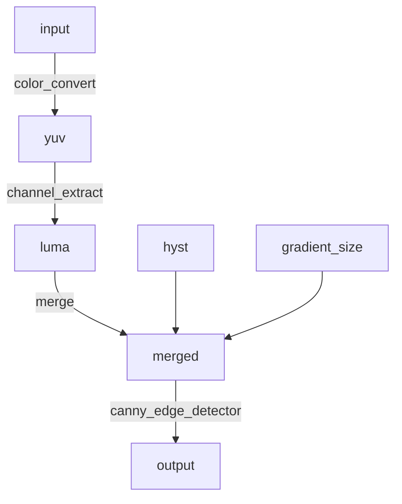

[TOC]

Visionworks OpenVX


# OpenVX

heterogeneous computation framework

[Spec](https://www.khronos.org/registry/OpenVX/specs/1.1/html/d0/d84/page_design.html) 

[OpenVX 1.2源碼解析 — 目錄結構](https://medium.com/@kobeyu/openvx-1-2源碼解析-目錄結構-3e5e04c2988f)


除了官方的參考實作外,下方是不同廠商的實作,有些有開放原始碼有些則是包裝程動態函式庫.

1. [Intel Computer Vision SDK](https://software.intel.com/en-us/computer-vision-sdk)
2. [AMD OVX :](https://github.com/GPUOpen-ProfessionalCompute-Libraries/MIVisionX) ~~https://github.com/GPUOpen-ProfessionalCompute-Libraries/amdovx-core~~ --> 
3. [TI OVX:](http://processors.wiki.ti.com/index.php/Processor_SDK_TIOVX) 
4. [Nvidia Vision Works:](https://developer.nvidia.com/embedded/visionworks) 

以上是有通過conformance test的廠商,另外ARM 也有類似的SDK(compute library)而且初期開發時在架構上也是參考OpenVX。

1. [ARM compute library:](https://github.com/ARM-software/ComputeLibrary) 

雖然一開始OpenVX是針對電腦視覺運算設計的軟體框架,但由於類神經網路的編程模式(programming model)跟熱門程度讓Khronos OpenVX工作小組也特別訂定了[Neural Network Extension](https://www.khronos.org/registry/OpenVX/extensions/neural_network_1.2/OpenVX_NN_Extension_1_2.pdf)使得OpenVX也加入了深度學習的戰場。


# VisionWorks 

[**NVIDIA VisionWorks toolkit**](https://developer.nvidia.com/embedded/visionworks) is a software development package for computer vision (CV) and image processing. VisionWorks™ implements and extends the <u>Khronos OpenVX standard</u>, and it is optimized for CUDA-capable GPUs and SOCs enabling developers to realize CV applications on a scalable and flexible platform.

#### VisionWorks includes the following primitives:

**IMAGE ARITHMETIC**

- Absolute Difference
- Accumulate Image
- Accumulate Squared
- Accumulate Weighted
- Add / Subtract / Multiply +
- Channel Combine
- Channel Extract
- Color Convert +
- CopyImage
- Convert Depth
- Magnitude
- MultiplyByScalar
- Not / Or / And / Xor
- Phase
- Table Lookup
- Threshold

**FLOW & DEPTH**

- Median Flow
- Optical Flow (LK) +
- Semi-Global Matching
- Stereo Block Matching
- IME Create Motion Field
- IME Refine Motion Field
- IME Partition Motion Field

**GEOMETRIC TRANSFORMS**

- Affine Warp +
- Warp Perspective +
- Flip Image
- Remap
- Scale Image +

**FILTERS**

- BoxFilter
- Convolution
- Dilation Filter
- Erosion Filter
- Gaussian Filter
- Gaussian Pyramid
- Laplacian3x3
- Median Filter
- Scharr3x3
- Sobel 3x3

**FEATURES**

- Canny Edge Detector
- FAST Corners +
- FAST Track +
- Harris Corners +
- Harris Track
- Hough Circles
- Hough Lines

**ANALYSIS**

- Histogram
- Histogram Equalization
- Integral Image
- Mean Std Deviation
- Min Max Locations

# OpenVX for us

## Requirements

- [x] Support user defined processing
- [ ] Support optimization of duplicate processing
- [ ] Open source framework (if available)


## User defined processing

Yes. user node, base it on the Advanced Tiling Extensions (see the [Intel's Extensions to the OpenVX* API: Advanced Tiling](https://software.intel.com/node/f1e3be86-0f4d-483b-a300-34e4b1015cb9) chapter)

## Support optimization of duplicate processing


ref:

[optimization tips](https://software.intel.com/en-us/openvino-ovx-guide-openvx-performance-tips)

- Use virtual images whenever possible, as this unlocks many graph compiler optimizations.
- Whenever possible, prefer standard nodes and/or extensions over user  kernel nodes (which serve as memory and execution barriers, hindering  performance). This gives the Pipeline Manager much more flexibility to  optimize the graph execution.
- If you still need to implement a user node, base it on the Advanced Tiling Extensions (see the [Intel's Extensions to the OpenVX* API: Advanced Tiling](https://software.intel.com/node/f1e3be86-0f4d-483b-a300-34e4b1015cb9) chapter)
- If the application has independent graphs, run these graphs in parallel using `vxScheduleGraph` API call.
- Provide enough parallel slack to the scheduler- do not break work  (for example, images) into too many tiny pieces. Consider kernel fusion.
- For images, use smallest data type that fits the application accuracy needs (for example, 32->16->8 bits).
- Consider heterogeneous execution (see the [Heterogeneous Computing with OpenVINO™ toolkit](https://software.intel.com/node/03a687f6-de98-436f-be61-b363462fc281) chapter).
- You can create an OpenVX image object that references a memory that was externally allocated (`vxCreateImageFromHandle`). To enable zero-copy with the GPU the externally allocated memory should be aligned.  For more details, refer to https://software.intel.com/en-us/node/540453.
- Beware of the (often prohibitive) `vxVerifyGraph` latency  costs. For example, construct the graph in a way it would not require  the verification upon the parameters updates. Notice that unlike  Map/Unmap for the input images (see the [Map/Unmap for OpenVX* Images](https://software.intel.com/node/19bee662-1fb7-4cd1-a4e7-8f9bc8101117)  section), setting new images with different meta-data (size, type, etc)  almost certainly triggers the verification, potentially adding  significant overhead.

## Open source framework (if available)

# OpenVino

[Requirements](https://software.intel.com/en-us/openvino-toolkit/choose-download/free-download-windows)

### Software Requirements

A Windows build environment needs these components:

- [Intel® HD Graphics Driver](https://downloadcenter.intel.com/product/80939/Graphics-Drivers) (latest version)†
- [OpenCV 3.4](https://opencv.org/releases.html) or higher
- [Intel® C++ Compiler 2017 Update 4](https://software.intel.com/en-us/articles/redistributables-for-intel-parallel-studio-xe-2017-composer-edition-for-linux)
- [CMake* 2.8](https://cmake.org/download/) or higher
- [Python* 3.5](https://www.python.org/downloads/) or higher
- [Visual Studio* 2015 or 2017](https://www.visualstudio.com/vs/older-downloads/)

### Get the Software

Your license includes the full version of the product. To access the toolkit:

1. Make sure your system meets the minimum requirements listed on this page.
2. Complete the registration form.
3. Download the product.

[Register & Download](https://software.seek.intel.com/openvino-toolkit?os=windows)


# [AMD OpenVX](https://github.com/GPUOpen-ProfessionalCompute-Libraries/amdovx-core)

## Features

- The code is highly optimized for both x86 CPU and OpenCL for GPU
- Supported hardware spans the range from low power embedded APUs (like the new G series) to laptop, desktop and workstation graphics
- Supports Windows, Linux, and OS X
- Includes a “graph optimizer” that looks at the entire processing pipeline and removes/replaces/merges functions to improve performance and minimize bandwidth at runtime
- Scripting support allows for rapid prototyping, without re-compiling at production performance levels

## Pre-requisites

- CPU: SSE4.1 or above CPU, 64-bit.

- GPU: Radeon Professional Graphics Cards or Vega Family of Products (16GB required for vx_loomsl and vx_nn libraries)

  - Windows: install the latest drivers and OpenCL SDK [download](https://github.com/GPUOpen-LibrariesAndSDKs/OCL-SDK/releases)
  - Linux: install [ROCm](https://rocm.github.io/ROCmInstall.html)

- OpenCV 3 (optional)

   

  download

   

  for RunVX

  - Set OpenCV_DIR environment variable to OpenCV/build folder

## Build Instructions

Build this project to generate AMD OpenVX library and RunVX executable.

- Refer to [openvx/include/VX](https://github.com/GPUOpen-ProfessionalCompute-Libraries/amdovx-core/blob/develop/openvx/include/VX) for Khronos OpenVX standard header files.
- Refer to [openvx/include/vx_ext_amd.h](https://github.com/GPUOpen-ProfessionalCompute-Libraries/amdovx-core/blob/develop/openvx/include/vx_ext_amd.h) for vendor extensions in AMD OpenVX library.
- Refer to [runvx/README.md](https://github.com/GPUOpen-ProfessionalCompute-Libraries/amdovx-core/blob/develop/runvx/README.md) for RunVX details.
- Refer to [runcl/README.md](https://github.com/GPUOpen-ProfessionalCompute-Libraries/amdovx-core/blob/develop/runcl/README.md) for RunCL details.

### Build using Visual Studio Professional 2013 on 64-bit Windows 10/8.1/7

- Install OpenCV 3 with contrib [download](https://github.com/opencv/opencv/releases) for RunVX tool to support camera capture and image display (optional)
- OpenCV_DIR environment variable should point to OpenCV/build folder
- Use amdovx-core/amdovx.sln to build for x64 platform
- If AMD GPU (or OpenCL) is not available, set build flag ENABLE_OPENCL=0 in openvx/openvx.vcxproj and runvx/runvx.vcxproj.


## Test

Download to C:\Users\test\Downloads

- C:\Users\test\Downloads\amdovx-core-0.9-beta2
- C:\Users\test\Downloads\opencv

Build SW according to guidelines, especially

- set ENABLE_OPENCL=0
- modify lib to C:\Users\test\Downloads\opencv\build\x64\vc12\lib\opencv_world310d.lib


Demo

```bash
C:\Users\test\Downloads\amdovx-core-0.9-beta2\amdovx-core-0.9-beta2>runvx exa
mples\gdf\canny.gdf

***** VIDEOINPUT LIBRARY - 0.1995 - TFW07 *****

runvx.exe 0.9.7
OK: using AMD OpenVX 0.9.7
OK: enabled graph scheduling in separate threads
csv,HEADER ,STATUS, COUNT,cur-ms,avg-ms,min-ms,clenqueue-ms,clwait-ms,clwrite-ms
,clread-ms
OK: capturing 480x360 image(s) into 480x360 RGB image buffer
csv,OVERALL,  PASS,     1,      ,  8.60,  8.60,  0.00,  0.00,  0.00,  0.00 (medi
an 8.598)
> total elapsed time:   0.11 sec
Abort: Press any key to exit...

```


canny.gdf

```python
# create input and output images
data input  = image:480,360,RGB2
data output = image:480,360,U008

# specify input source for input image and request for displaying input and output images
read input  examples/images/face1.jpg
view input  inputWindow
view output edgesWindow

# compute luma image channel from input RGB image
data yuv  = image-virtual:0,0,IYUV
data luma = image-virtual:0,0,U008
node org.khronos.openvx.color_convert input yuv
node org.khronos.openvx.channel_extract yuv !CHANNEL_Y luma

# compute edges in luma image using Canny edge detector
data hyst = threshold:RANGE,UINT8:INIT,80,100
data gradient_size = scalar:INT32,3
node org.khronos.openvx.canny_edge_detector luma hyst gradient_size !NORM_L1 output

```




## runvx

usage

```python
C:\Users\test\Downloads\amdovx-core-0.9-beta2\amdovx-core-0.9-beta2>runvx

***** VIDEOINPUT LIBRARY - 0.1995 - TFW07 *****

runvx.exe 0.9.7

Usage:
  runvx.exe [options] [file] <file.gdf> [argument(s)]
  runvx.exe [options] node <kernelName> [argument(s)]
  runvx.exe [options] shell [argument(s)]

The argument(s) are data objects created using <data-description> syntax.
These arguments can be accessed from inside GDF as $1, $2, etc.

The available command-line options are:
  -h
      Show full help.
  -v
      Turn on verbose logs.
  -root:<directory>
      Replace ~ in filenames with <directory> in the command-line and
      GDF file. The default value of '~' is current working directory.
  -frames:[<start>:]<end>|eof|live
      Run the graph/node for specified frames or until eof or just as live.
      Use live to indicate that input is live until aborted by user.
  -affinity:CPU|GPU[<device-index>]
      Set context affinity to CPU or GPU.
  -dump-profile
      Print performance profiling information after graph launch.
  -enable-profile
      use directive VX_DIRECTIVE_AMD_ENABLE_PROFILE_CAPTURE when graph is create
d
  -discard-compare-errors
      Continue graph processing even if compare mismatches occur.
  -disable-virtual
      Replace all virtual data types in GDF with non-virtual data types.
      Use of this flag (i.e. for debugging) can make a graph run slower.

```

dump profile

```python
C:\Users\test\Downloads\amdovx-core-0.9-beta2\amdovx-core-0.9-beta2>runvx -du
mp-profile examples\gdf\canny.gdf

***** VIDEOINPUT LIBRARY - 0.1995 - TFW07 *****

runvx.exe 0.9.7
OK: using AMD OpenVX 0.9.7
OK: enabled graph scheduling in separate threads
csv,HEADER ,STATUS, COUNT,cur-ms,avg-ms,min-ms,clenqueue-ms,clwait-ms,clwrite-ms
,clread-ms
OK: capturing 480x360 image(s) into 480x360 RGB image buffer
csv,OVERALL,  PASS,     1,      ,  8.62,  8.62,  0.00,  0.00,  0.00,  0.00 (medi
an 8.621)
> total elapsed time:   0.07 sec
> graph profile:
 COUNT,tmp(ms),avg(ms),min(ms),max(ms),DEV,KERNEL
     1,  8.621,  8.621,  8.621,  8.621,CPU,GRAPH
     1,  1.196,  1.196,  1.196,  1.196,CPU,com.amd.openvx.ColorConvert_Y_RGB
     1,  4.905,  4.905,  4.905,  4.905,CPU,com.amd.openvx.CannySobel_U16_U8_3x3_
L1NORM
     1,  2.305,  2.305,  2.305,  2.305,CPU,com.amd.openvx.CannySuppThreshold_U8X
Y_U16_3x3
     1,  0.208,  0.208,  0.208,  0.208,CPU,com.amd.openvx.CannyEdgeTrace_U8_U8XY

Abort: Press any key to exit...

```

Test if CSE works

input

```python
# create input and output images
data input  = image:480,360,RGB2
data output = image:480,360,U008
data output2 = image:480,360,U008

# specify input source for input image and request for displaying input and output images
read input  examples/images/face1.jpg
view input  inputWindow
view output edgesWindow

# compute luma image channel from input RGB image
data yuv  = image-virtual:0,0,IYUV
data yuv2  = image-virtual:0,0,IYUV
data luma = image-virtual:0,0,U008
data luma2 = image-virtual:0,0,U008
node org.khronos.openvx.color_convert input yuv
node org.khronos.openvx.color_convert input yuv2
node org.khronos.openvx.channel_extract yuv !CHANNEL_Y luma
node org.khronos.openvx.channel_extract yuv2 !CHANNEL_Y luma2

# compute edges in luma image using Canny edge detector
data hyst = threshold:RANGE,UINT8:INIT,80,100
data gradient_size = scalar:INT32,3
node org.khronos.openvx.canny_edge_detector luma hyst gradient_size !NORM_L1 output
node org.khronos.openvx.canny_edge_detector luma2 hyst gradient_size !NORM_L1 output2
```

Output

```python
C:\Users\test\Downloads\amdovx-core-0.9-beta2\amdovx-core-0.9-beta2>runvx -du
mp-profile examples\gdf\canny.gdf

***** VIDEOINPUT LIBRARY - 0.1995 - TFW07 *****

runvx.exe 0.9.7
OK: using AMD OpenVX 0.9.7
OK: enabled graph scheduling in separate threads
csv,HEADER ,STATUS, COUNT,cur-ms,avg-ms,min-ms,clenqueue-ms,clwait-ms,clwrite-ms
,clread-ms
OK: capturing 480x360 image(s) into 480x360 RGB image buffer
csv,OVERALL,  PASS,     1,      , 17.13, 17.13,  0.00,  0.00,  0.00,  0.00 (medi
an 17.127)
> total elapsed time:   0.07 sec
> graph profile:
 COUNT,tmp(ms),avg(ms),min(ms),max(ms),DEV,KERNEL
     1, 17.127, 17.127, 17.127, 17.127,CPU,GRAPH
     1,  1.202,  1.202,  1.202,  1.202,CPU,com.amd.openvx.ColorConvert_Y_RGB
     1,  1.192,  1.192,  1.192,  1.192,CPU,com.amd.openvx.ColorConvert_Y_RGB
     1,  4.857,  4.857,  4.857,  4.857,CPU,com.amd.openvx.CannySobel_U16_U8_3x3_
L1NORM
     1,  4.838,  4.838,  4.838,  4.838,CPU,com.amd.openvx.CannySobel_U16_U8_3x3_
L1NORM
     1,  2.312,  2.312,  2.312,  2.312,CPU,com.amd.openvx.CannySuppThreshold_U8X
Y_U16_3x3
     1,  2.302,  2.302,  2.302,  2.302,CPU,com.amd.openvx.CannySuppThreshold_U8X
Y_U16_3x3
     1,  0.209,  0.209,  0.209,  0.209,CPU,com.amd.openvx.CannyEdgeTrace_U8_U8XY

     1,  0.207,  0.207,  0.207,  0.207,CPU,com.amd.openvx.CannyEdgeTrace_U8_U8XY

Abort: Press any key to exit...


```

Q: Why CSE not work?

TODO: 


## API

```cpp
//vx_api.h
VX_API_ENTRY vx_graph VX_API_CALL vxCreateGraph(vx_context context);
VX_API_ENTRY vx_status VX_API_CALL vxVerifyGraph(vx_graph graph);
VX_API_ENTRY vx_status VX_API_CALL vxProcessGraph(vx_graph graph);
VX_API_ENTRY vx_image VX_API_CALL vxCreateVirtualImage(vx_graph graph, vx_uint32 width, vx_uint32 height, vx_df_image color);

//vx_node.h
VX_API_ENTRY vx_node VX_API_CALL vxColorConvertNode(vx_graph graph, vx_image input, vx_image output);
```


# OpenCV [G-API](N:\3rd_sw\OpenCV\4.0\sources\modules\gapi\samples)

## Intro

[G-API Intro](file:///C:/Users/test/Downloads/2018-12-24-GAPI_Overview.pdf)

Features


## API

```cpp
//core.hpp
GAPI_EXPORTS GMat resize(const GMat& src, const Size& dsize, double fx = 0, double fy = 0, int interpolation = INTER_LINEAR);

//GComputation.hpp
class GComputation{
    ...
    GComputation(GProtoInputArgs &&ins,
                 GProtoOutputArgs &&outs);             // Arg-to-arg overload
	void apply(GRunArgs &&ins, GRunArgsP &&outs, GCompileArgs &&args = {});
...
}
```

## implementation

of G-API apply function

```sequence
GComputation -> GComputation2: apply
GComputation2 -> GCompiler: compile
GCompiler -> Graph: build graph
Graph --> GComputation2: return ade::Graph
GComputation2 -> Graph: exec the graph
```

ref:


# Vision grab post processing

Study if OpenVINO or OpenCV supports

- CSE（common-subexpression elimination）
- feed partially inputs


| Lib          | CSE  | partially inputs                                             |
| ------------ | ---- | ------------------------------------------------------------ |
| OpenVINO     | x    | x                                                            |
| AMDOVX       | x    | x                                                            |
| OpenCV G-API | x    | x                                                            |
| Intel TBB    | x    | v<br />behavior: the ready nodes are called then exit<br />Code: C:\test\codes\lua\src\tbbtest\test_tbb_behavior.cpp |
| Tensorflow   | v    |                                                              |


TODO

Test if  can be called multiples like following

```cpp
while true
    modify input
    vxProcessGraph()
```

ref: http://projects.eees.dei.unibo.it/adrenaline/tutorial-02-execute-openvx-examples/

OpenVX讀書筆記


# summary

|       | high level                                                   | low level                                                    |
| ----- | ------------------------------------------------------------ | ------------------------------------------------------------ |
| ovx   | strong typed<br />eg VX_API_ENTRY vx_node VX_API_CALL vxColorConvertNode(vx_graph graph, vx_image input, vx_image output); | weak typed, eg<br />OpenVX.dll!agoCreateNode(_vx_graph * graph, int kernel_id) |
| tbb   | strong typed<br />make_edge(tbb::flow::output_port<1>(gpu_slm_split_n), tbb::flow::input_port<1>(gpu_slm_mat_mult_n))<br />tbb::flow::function_node< validation_args_type > mat_validation_n(g, tbb::flow::unlimited, [](const validation_args_type& result) {<br/>        // Get references to matrixes<br/>        const tbb::flow::gfx_buffer<float>& GPU_SLM_MAT   = std::get<0>(result);<br/>        const tbb::flow::gfx_buffer<float>& CPU_SLM_MAT   = std::get<1>(result);<br/>        const tbb::flow::gfx_buffer<float>& CPU_NAIVE_MAT = std::get<2>(result);<br/><br/>        // Verify results<br/>        // Check that slm algorithm produces correct results on CPU:<br/>        validate_mat("matrix multiply: 'SLM' CPU vs. CPU", SIZE_Y, SIZE_X, CPU_SLM_MAT.data(), CPU_NAIVE_MAT.data());<br/>        // Verify Gen results:<br/>        validate_mat("matrix multiply: SLM Gen vs. CPU", SIZE_Y, SIZE_X, GPU_SLM_MAT.data(), CPU_NAIVE_MAT.data());<br/>    }); | Not sure                                                     |
| G-API | strong typed                                                 | TODO                                                         |

// ovx: \\vis_bep_12\C\Users\test\Downloads\amdovx-core-0.9-beta2\amdovx-core-0.9-beta2
// tbb: C:\Users\test\Downloads\tbb2017_20170604oss_win\tbb2017_20170604oss

# How to register Kernel

Define a enum 

```cpp
VX_KERNEL_COLOR_CONVERT = VX_KERNEL_BASE(VX_ID_KHRONOS, VX_LIBRARY_KHR_BASE) + 0x1,
```

Registrtion

```cpp
OVX_KERNEL_ENTRY( VX_KERNEL_COLOR_CONVERT         , ColorConvert, "color_convert",             AIN_AOUT,             ATYPE_II           , false ), 
```

the parameters meaning

```cpp
#define OVX_KERNEL_ENTRY(kernel_id,name,kname,argCfg,argType,validRectReset) \
```

```cpp
#define ATYPE_II                               { VX_TYPE_IMAGE, VX_TYPE_IMAGE }

```

- AIN_AOUT: 1 in, 1 out
- ATYPE_II: 2 image types

Implement "DramaDivideNode" operation, it is used to select the best suited for this PC architecture

```cpp
int agoDramaDivideNode(AgoNodeList * nodeList, AgoNode * anode)
{
	// save parameter list
	vx_uint32 paramCount = anode->paramCount;
	AgoData * paramList[AGO_MAX_PARAMS]; memcpy(paramList, anode->paramList, sizeof(paramList));
	// divide the node depending on the type
	int status = -1;
	switch (anode->akernel->id)
	{
		case VX_KERNEL_COLOR_CONVERT:
			status = agoDramaDivideColorConvertNode(nodeList, anode);
			break;
```

the function is called by optimize function

```cpp
>	OpenVX.dll!agoCreateNode(_vx_graph * graph, int kernel_id) Line 2699	C++
 	OpenVX.dll!agoDramaDivideAppend(AgoNodeList * nodeList, _vx_node * anode, int new_kernel_id, _vx_reference * * paramList, unsigned int paramCount) Line 37	C++
 	OpenVX.dll!agoDramaDivideAppend(AgoNodeList * nodeList, _vx_node * anode, int new_kernel_id) Line 56	C++
 	OpenVX.dll!agoDramaDivideColorConvertNode(AgoNodeList * nodeList, _vx_node * anode) Line 244	C++
 	OpenVX.dll!agoDramaDivideNode(AgoNodeList * nodeList, _vx_node * anode) Line 1818	C++
 	OpenVX.dll!agoOptimizeDramaDivide(_vx_graph * agraph) Line 1962	C++
 	OpenVX.dll!agoOptimizeDrama(_vx_graph * agraph) Line 522	C++
 	OpenVX.dll!agoOptimizeGraph(_vx_graph * agraph) Line 209	C++
 	OpenVX.dll!vxVerifyGraph(_vx_graph * graph) Line 2450	C++
 	runvx.exe!CVxEngine::ProcessGraph(std::vector<char const *,std::allocator<char const *> > * graphNameList, unsigned __int64 beginIndex) Line 285	C++
```

# How to schedule graph?

# What optimization is done in optimize()?

Choose the best