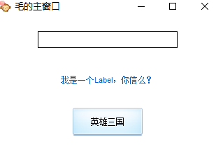
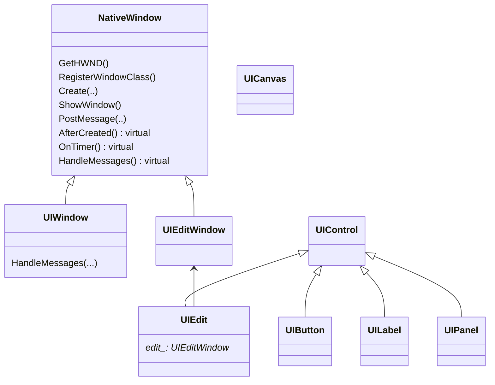

# 什么是AUI

最简单的DirectUI实现，麻雀虽小，五脏俱全。



# 使用方法

## 主代码

```cpp
InitAUI();

YourMainWindow window;
window.Create(...);
window.SetWindowMinSize(300,350);
window.SetAsMainWindow();
window.CenterWindow();
window.ShowWindow();

while((bRet = GetMessage( &msg, NULL, 0, 0 )) != 0)
{
    TranslateMessage(&msg); 
    DispatchMessage(&msg); 
}

CleanUpAUI();
```

## 如何编写YourMainWindow

要从UIWindow, IUINotify继承

重载AfterCreated（）用来创建控件

重载`Notify(UINotifyEvent event,UIControl *control)`来处理消息

Q: 如何创建控件树？

首先AddRootControl添加根控件

然后在根控件下面用AddSubControl添加子控件

Q: 一定要从IUINotify继承吗？

不是。你也可以用组合方式，定义一个IUINotify的成员变量，用AddNotifier把他加入到通知列表


## 如何编写control

从UIControl继承

重载`void  RenderSelf(const UIRect *rect)`实现自我绘制

重载各种消息响应比如mousemove

Q：如何绘制？

在绘制函数里面拿到`UICanvas`,就可以调用相关比如DrawImage，DrawText函数

# class diagram

Q:NativeWindow和UIWindow的分别是什么？

我感觉他是想把OS相关的东西和OS无关的东西分开。但其实没有分好

Q：如何实现自绘

拿到`UICanvas`,就可以调用相关比如DrawImage，DrawText函数



