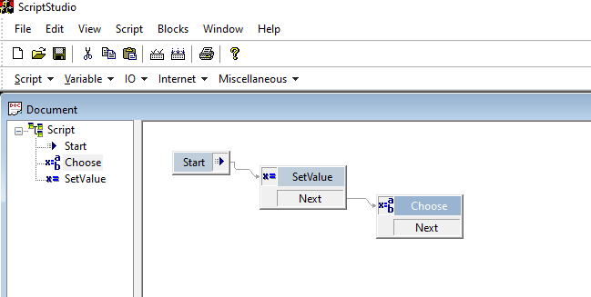
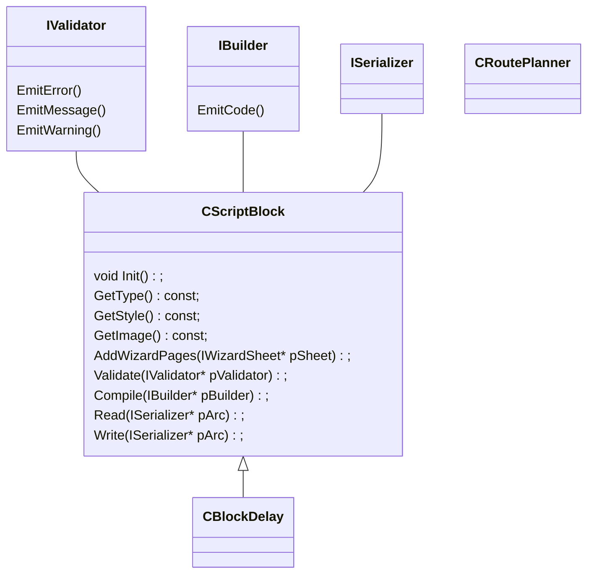

script studio源码分析

# 什么是script studio

一个可视化流程图编程工具



# class diagram

## 相关类的作用

CScriptBlock：一个block的基类

IValidator：验证数据？代码里没用

IBuilder：生成代码，代码里没用

## 如何实现一个block



# 

 

 

# Analysis

## class功能分析

`CChildFrame`

​     `CExplorerView` 左侧的选择树

​     `CScriptView`        右侧的可视化脚本编辑窗口

​          头文件dingyi各种支持的控件（算法）

​     `CScriptDoc`

​     `CScriptBlock`   脚本元件接口定义基类

​          一个元件叫做一个`CScriptBlock`

​              包含的输入输出引脚叫做`TScriptLink`

​              前后父子关系链表

​              `ISerializer`

​                   每个block有一个唯一的id

​                   有一个厂函数`CScriptBlock::CreateInstance`，根据id创建任意block

​                   它里面hardcode了这些类型的block，更好的做法是让元件根据名字或者类似于windows的iid自己注册自己

​     具体的每个类型

​          `CBlockRoot`    根block

​          Q：每个block怎样画是哪里做的？

参考 `void CScriptView::DoPaint(CDCHandle dc)  `

```cpp
_DoPaintLinks

_DoPaintSpecialButtons

。。

_DoPaintMarkers

 

BOOL CChildFrame::_PopulateTree()

​     m_viewExplorer.Populate(m_doc.GetRoot(), m_pRoot);

​       SetRedraw(FALSE);

​       DeleteAllItems();

​       _PopulateTree(pRoot, TVI_ROOT);

​       Expand(GetRootItem());

​       Select(pLevel);

​       SetRedraw(TRUE);
```


​          

WTL添加一个新的基类COffscreenDraw处理消息

用户的派生类CScriptView

```cpp
class CScriptView : 

  public CWindowImpl<CScriptView>,

  public COffscreenDraw<CScriptView>

​       BEGIN_MSG_MAP(CScriptView)

   CHAIN_MSG_MAP( COffscreenDraw<CScriptView> )
```


基类COffscreenDraw    

```cpp


  template< class T >

​     class COffscreenDraw

​     {

​     public:

​       BEGIN_MSG_MAP(COffscreenDraw)

​           MESSAGE_HANDLER(WM_PAINT, OnPaint)

```

## QA

​          Q：每个元件的拖放处理，是全图刷新吗？

是       

`OnLButtonDown`里面`HitTest`看看鼠标点到了什么

 

有别的例子使用了一些技巧比如https://msdn.microsoft.com/zh-tw/library/windows/desktop/ms645602(v=vs.85).aspx#drawing_lines

 

### 鼠标移动绘图处理

在鼠标移动时，首先用反色把之前画的擦掉，之后再在新的位置重画setrop2？

这样就不需要刷新整个区域了

 

​          Q：画一个新的原件是怎样处理的？

​          q: 如何处理scroll消息？

​          GetScrollInfo，之后根据类型调整变量nPos，然后再SetScrollPos（这是为了让拖动条随着鼠标移动？否则拖动条不动？）

​          在调用全局刷新函数Invalidate重画

​          

​          重画函数里面用 dc.SetWindowOrg(-m_ptOffset.x, -m_ptOffset.y);修改画的时候坐标系

来简化计算       

​          q：SetCapture有啥用呢？

​          莫非就是即使鼠标出界了还能拿到消息？

​          q：如何把原件拖到屏幕边缘时自动scroll？

参考`void CScriptView::_DragScrollView(LPARAM lParam)`

​          通过`SendMessage`

​          

## 链接算法   void CScriptView::_LayoutLinks()

​     使用的数据结构是`SCRIPTLINK`的链表，每个节点为`SCRIPTITEM`，节点的一项`pLinks`指向`connection`链表

​     链表里面有个数组`ptWaypoints`【】表示要画出链接的轨迹定点数组

​     所以该算法主要使计算如何填充该数组

​     方法

​          `SC_EX_SIMPLELAYOUT`  两个顶点，直接连接一条直线

​          `SC_EX_TITLEBAR`

​          `SC_EX_SHAREIMAGELIST`     链接的直线为水平或者垂直

​              类`CRoutePlanner`用来做这个规划

​              该方法把图像分成棋盘格，在规划之前将已有的节点位置标记为墙，即不可规划区域（见BlockNode函数）。

​              对每个connection调用PlanRoute函数实现规划

创建每个block

​     `CScriptBlock* CScriptBlock::CreateInstance(WORD wID)`

显示block

​     `void CScriptView::_DoPaintNormalButtons(CDCHandle dc, RECT /*rcClip*/, CSimpleArray<int>& aOrder)`

​     

# todo

做一个general的框架，用户可以动态添加新的模块

现在这个其实已经是可以动态添加模块了

主要功能

在init里面指定输入输出AddInput AddOutput

设置名字啊之类的东西

添加孩子

 

缺陷：

模块的图标，id和主程序紧密偶合在一起了，需要分开

模块要提供属性对话框，允许动态添加和删除输入输出

 

\- 每个模块可以指定work，框架能够用户的flowchart

\- 参考workflow foundation添加更多的block

\- 替换掉原本的BEGIN_MSG_MAP机制，改为signal slot

 