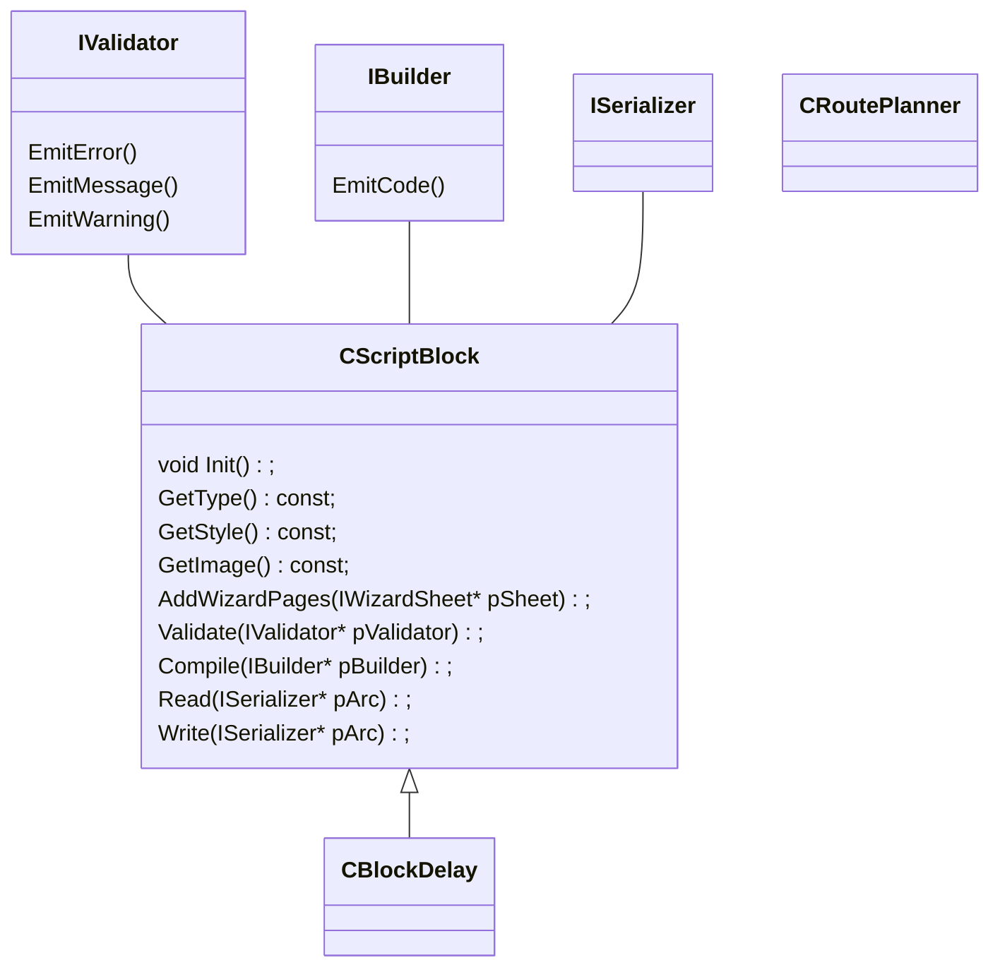

script studio源码分析

# 什么是script studio

一个可视化流程图编程工具

# class diagram

## 相关类的作用

CScriptBlock：一个block的基类

IValidator：验证数据？代码里没用

IBuilder：生成代码，代码里没用

## 如何实现一个block

```mermaid
classDiagram
IValidator -- CScriptBlock
IBuilder -- CScriptBlock
ISerializer -- CScriptBlock
CScriptBlock <|-- CBlockDelay

class IBuilder{
	EmitCode()
}
class IValidator{
	EmitError()
	EmitMessage()
	EmitWarning()
}
class CScriptBlock{
   void Init();
   GetType() const;
   GetStyle() const;
   GetImage() const;
   AddWizardPages(IWizardSheet* pSheet);
   Validate(IValidator* pValidator);
   Compile(IBuilder* pBuilder);
   Read(ISerializer* pArc);
   Write(ISerializer* pArc);
}

class CRoutePlanner{
	
}
```

