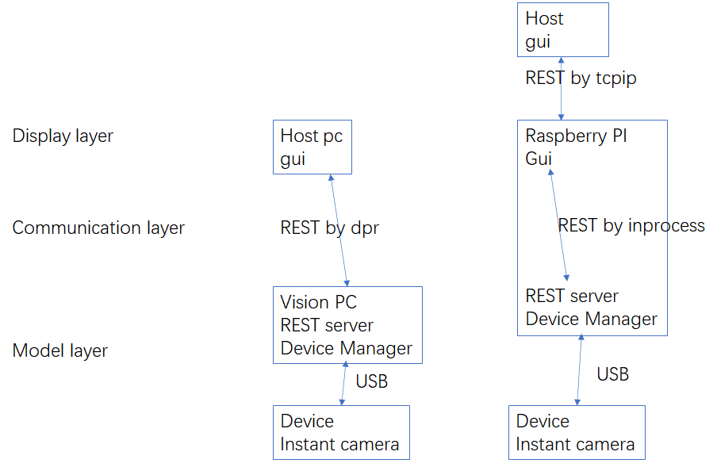

instant camera的系統架構

# 軟件設計的目標

设计是为了让软件在长期更容易适应变化。 — Kent Beck

软件设计的优劣在根本上决定了软件系统的质量。好的设计，可以让系统更容易修改和扩展，不好的设计，却会让人举步维艰

**软件设计=模型+规范**

软件设计的第一步：分离关注点

第二点：找到一个最小的核心模型

# 分离关注点

分离关注点总的思路可以归结两点：**拆分+归类**


需求1：短期内是搭建在现有的vision系统之上，但长期有機會像smart camera一樣工作

支持現有經過vision連接相機
支持以後通過其他程序比如host連接相機
支持以後經過tcpip鏈接相機

需求1意味着我们的系统可以单机，也可以分布式独立运行

需求2：gui可能性

短期内我们没有gui，host来做gui

长期有机会我们有自己的gui

需求3：相机的应用短期内有三个，以后会越来越多

目標。我们的设计要满足短期和长期需求


关注点1：显示层，负责把用户的操作转化为消息，以及把消息转化为gui显示

关注点2：数据传输层，负责在显示层和模型层之间传送消息

关注点3：模型层，负责做事情

# 模型

一个好的设计，应该找到一个最小的核心模型，所有其他的内容都是在这个核心模型上生长出来的，越小的模型越容易理解，相对地，也越容易保持稳定。比如设计一个http mock服务器，其核心模型为`server.request("foo").response("bar");` 一方面表达出预期；另一方面给出返回的结果。


相机通过usb接口连接到device manager。device manager可以是一台pc（比如vision pc或者任意PC），或者一个嵌入式硬件比如树莓派

device manager暴露出REST服务给客户端

客户端编写gui与REST服务通讯



==画图描述该模型在不同硬件结构下的组件图==


# 接口

所谓接口，它是用户与软件交互的入口，约定了软件通过怎样的方式对外暴露自己的能力。

## 对外接口：客户端如何使用

建议定义一种类似于[REST](https://zh.wikipedia.org/wiki/%E8%A1%A8%E7%8E%B0%E5%B1%82%E7%8A%B6%E6%80%81%E8%BD%AC%E6%8D%A2)或者websocket的架构风格，其特点是

- 资源是由URI来指定。
- 对资源的操作包括获取、创建、修改和删除
- 通过操作资源的表现形式来操作资源。
- 资源的表现形式则是XML或者JSON。

举例

列举所有相机 `GET http://ip/cameras`

查看某一个相机  `GET http://ip/cameras/1`

修改某一个相机的参数 

```
POST http://ip/cameras/1
{
“mode": "auto_run"
}
```

优点:Uniform Interface：统一接口，很强的扩展性

缺点:没有callback

## 对内接口：如何加入新的设备

注册设备，设备自动发现，设备控制，。。。

# 实现